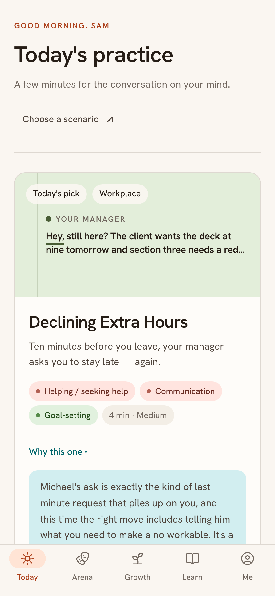
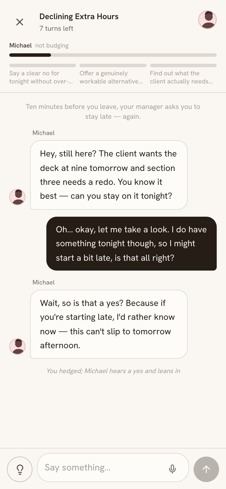
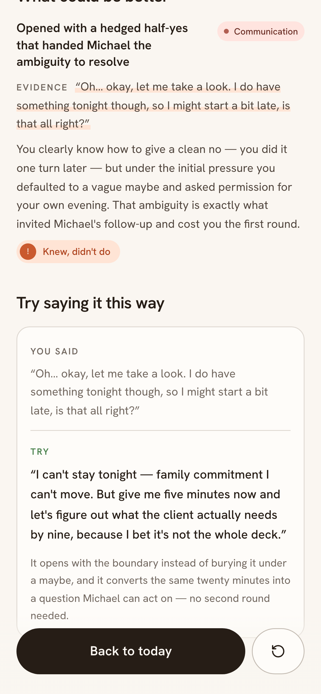
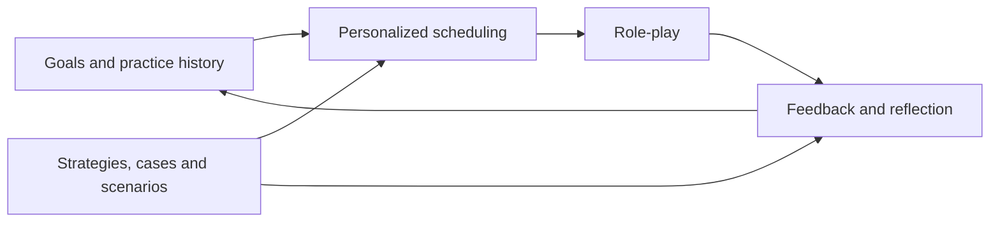

<div align="center">

<picture>
  <source media="(prefers-color-scheme: dark)" srcset="docs/banner-dark.svg">
  
</picture>

**Your personal EQ coach.**

Build social skills and learn to handle conflict through realistic role-play and personalized feedback.

[](https://socialcoach.aurax.live)
[](https://arxiv.org/abs/2606.04155)
[](LICENSE)

[English](README.md) · [简体中文](README.zh-CN.md)

</div>

---

[Practice](#what-you-can-practice) · [How it works](#how-it-works) · [Features](#key-features) · [Quick start](#quick-start) · [Deployment](#deployment) · [Research](#research)

## What you can practice

A conversation with your manager. A boundary with a friend. A disagreement at home. SocialCoach gives you a place to rehearse, see how your words land, and try again.

| When you want to… | Practice with… |
|---|---|
| Speak up at work | Asking for a raise, giving feedback, or declining extra hours |
| Set a boundary | Asking a friend to repay you or agreeing on rules with a roommate |
| Work through conflict | Sharing responsibilities with a partner or discussing career choices with family |
| Connect with people | Welcoming a new colleague, supporting a friend, or joining a conversation |

Choose from **46 scenarios across 7 areas of life**, follow a personalized recommendation, or describe your own situation. The interface and practice content are available in **English and Simplified Chinese**.

## Social skills and social and emotional learning (SEL)

SocialCoach is an AI learning tool focused on practicing social skills, one part of social and emotional learning (SEL). Its 34-skill map draws on the [five CASEL competencies](https://casel.org/what-is-sel/): self-awareness, self-management, social awareness, relationship skills, and responsible decision-making. You can rehearse a difficult conversation, then review feedback grounded in what you actually said. It is an individual practice tool, not a certified school curriculum or a clinical assessment. The [bilingual website](https://tianfuwang.tech/SocialCoach/) explains how the skills map to practice.

## How it works

1. **Choose a conversation.** Pick a skill or bring a situation you actually need to handle. Read your role and what you want to achieve.
2. **Practice the exchange.** Talk to characters with their own goals, concerns, and limits. They can disagree, ask questions, and hold their position.
3. **Review and try again.** See feedback tied to your actual words, consider another way to respond, and carry that lesson into your next attempt.

<table align="center">
<tr>
<th width="33%">1 · Your next practice</th>
<th width="33%">2 · The conversation</th>
<th width="33%">3 · Your feedback</th>
</tr>
<tr>
<td><a href="docs/screenshots/screenshot-01-home-en.png"></a></td>
<td><a href="docs/screenshots/screenshot-02-pushback-en.png"></a></td>
<td><a href="docs/screenshots/screenshot-03-evidence-debrief-en.png"></a></td>
</tr>
<tr>
<td><sub>A scenario matched to your goals.</sub></td>
<td><sub>Room to respond, disagree, and retry.</sub></td>
<td><sub>Your words, the feedback, the next step.</sub></td>
</tr>
</table>

<p align="center"><a href="https://socialcoach.aurax.live"><strong>Try a conversation →</strong></a></p>

## Key features

- **Realistic role-play.** Characters respond from their own perspective. Progress depends on how the conversation develops; politeness alone does not guarantee agreement. Optional timed replies add practice under pressure.
- **Feedback grounded in your words.** The debrief quotes what you said before evaluating it, then identifies whether you need a new strategy or more practice applying one. Communication quality and the outcome of the conversation are assessed separately, so a thoughtful response can still count even when the other person says no.
- **Personalized practice.** Recommendations draw on your goals, practice history, and estimated proficiency across 34 skills. Rehearse a situation from your own life or explore the scenario library.
- **Guidance with sources.** A library of 42 strategies and 30 cases supports coaching and reflection. Entries include their sources, and teaching examples are labelled.
- **A view of your progress.** Revisit past conversations, reflect with the coach, and look for recurring patterns backed by quotes from different sessions.
- **Practice on your terms.** No account required. Export your practice history, use your own model, or self-host the app. The mobile-first interface can be installed as a PWA.

## Quick start

To try the hosted app, [open SocialCoach](https://socialcoach.aurax.live). To run it locally, use **Node.js 22+**, **pnpm 11**, and credentials for an Anthropic or OpenAI-compatible model provider.

```bash
git clone https://github.com/GeminiLight/SocialCoach.git
cd SocialCoach/app
pnpm install
cp .env.example .env.local
```

Edit `.env.local` before starting:

| Variable | What to set |
|---|---|
| `LLM_PROVIDER` | `anthropic` or `openai` |
| `LLM_API_KEY` | Your provider's API key |
| `LLM_BASE_URL` | Your gateway's endpoint, or leave empty for the provider default |
| `LLM_FAST_MODEL` | A model ID available from your provider, for conversations and short coaching tasks |
| `LLM_SMART_MODEL` | A model ID available from your provider, for debriefs; this can be the same model |

```bash
pnpm dev
```

Open **[localhost:3000](http://localhost:3000)**. See [`.env.example`](app/.env.example) for all configuration options.

<details>
<summary><strong>Use your own model from the app</strong></summary>

In **Settings → Model**, configure an Anthropic or OpenAI-compatible provider. These credentials stay in your browser, which calls your provider directly. Custom endpoints must allow browser requests (CORS).

Set `LLM_REQUIRE_BYOK=true` to require visitors to bring their own credentials. Model requests then use each visitor's provider account; hosting costs still depend on your deployment.

For OpenAI-compatible endpoints that require `max_completion_tokens`, set `LLM_OPENAI_TOKEN_PARAM=max_completion_tokens`. The default is `max_tokens`.

</details>

## Deployment

| Option | Setup |
|---|---|
| **Docker Compose** | Use [`app/compose.yaml`](app/compose.yaml) for a single app instance with Caddy and automatic HTTPS. |
| **Vercel** | Set the project root to `app` and configure the model variables above. Check your deployment's function duration limits for longer debrief requests. |
| **[ModelScope](https://modelscope.cn/studios/GeminiLight/SocialCoach)** | Use the repository-root [`Dockerfile`](Dockerfile), which serves on port 7860. Configure credentials through Studio Secrets. See the [deployment guide](wiki/specs/spec-modelscope-deployment.md). |

<details>
<summary><strong>Docker Compose setup and operating notes</strong></summary>

From the repository root:

```bash
cd app
cp .env.production.example .env.production
```

Edit `.env.production` with your model credentials and rate limits. Replace `example.com` in `Caddyfile` with your domain, point its DNS to the host, and make ports 80 and 443 reachable. Then run:

```bash
docker compose up -d --build
```

The Dockerfiles include Next.js static assets in the standalone build. The Caddy configuration sets `flush_interval -1` for streaming responses.

[`lib/rate-limit.ts`](app/src/lib/rate-limit.ts) limits model calls per IP and per deployment. Counters are in memory: they reset on restart and are not shared across instances. Keep the Compose deployment to one app instance; use shared rate limiting if you scale beyond it.

</details>

## Data and privacy

Your profile, practice history, and progress are stored in your browser and can be exported from Settings. Model requests send the relevant conversation context to the configured model provider, through the app server or directly when using your own credentials.

<details>
<summary><strong>Usage statistics, feedback, and voice input</strong></summary>

- **Usage statistics:** when configured by the deployment and enabled in Settings, the app sends metadata such as scenario, duration, and outcome under a random device ID. These events exclude conversation text. You can disable them in Settings.
- **Product feedback:** feedback you choose to submit, including any optional contact details, is sent to the team's configured Feishu table.
- **Voice input:** your browser's speech-recognition service may send audio to its provider for transcription.

The core practice app needs no account system or database. Feedback and usage statistics are optional integrations; configuration is documented in [`.env.example`](app/.env.example).

</details>

## Architecture



The scheduler turns a practice prescription into a matching corpus scenario and personalized briefing. Shared task logic powers both server-side and browser-side model calls.

| Area | Source |
|---|---|
| Scenarios, strategies, cases, and skill taxonomy | [`app/src/data/`](app/src/data) |
| Scheduling, role-play, assessment, and reflection | [`app/src/lib/tasks/`](app/src/lib/tasks) |
| Server API routes | [`app/src/app/api/`](app/src/app/api) |
| Local learner state | [`app/src/store/`](app/src/store) |

**Stack:** Next.js 16 · React 19 · TypeScript · Tailwind CSS v4 · Zustand · Framer Motion · Zod · Anthropic and OpenAI SDKs.

**Design:** warm paper, editorial typography, and feedback that reads like a coach's margin notes. See the [design brief](app/.impeccable.md) and [system architecture](wiki/02-system-architecture.md).

## Research

SocialCoach builds on [*SocialCoach: Personalized Social Skill Learning with Agentic Tutoring and Practice*](https://arxiv.org/abs/2606.04155) (Wang et al., 2026).

The paper studies personalized practice scheduling and tutoring with a traceable theory-to-practice corpus. It also covers policy training, synthetic evaluations, and human studies. This repository contains the deployed application; its implementation and bundled corpus are documented here separately from the research experiments.

<details open>
<summary><strong>Cite the paper</strong></summary>

```bibtex
@article{wang2026socialcoach,
  title   = {SocialCoach: Personalized Social Skill Learning with Agentic Tutoring and Practice},
  author  = {Wang, Tianfu and Xiong, Max and Lian, Jianxun and Zhu, Hongyuan
             and Hu, Zhengyu and Lei, Yuxuan and Gong, Linxiao and Hu, Dapeng and Li, Xiaofang and Tsai, Peiting
             and Yuan, Nicholas Jing and Zhang, Qi},
  journal = {arXiv preprint arXiv:2606.04155},
  year    = {2026}
}
```

</details>

## Contributing

Bug reports, translations, and contributions are welcome. For bugs, include reproduction steps, your browser, and model configuration without API keys or private conversations.

For corpus contributions, start in [`app/src/data/corpus/`](app/src/data/corpus). Keep entries bilingual, provide a `source`, and label teaching examples. For development, read [`AGENTS.md`](AGENTS.md) and [`app/AGENTS.md`](app/AGENTS.md).

## Friends

[LinuxDo Community](https://linux.do) — a community for Linux, open source, and AI builders.

## License

Copyright 2026 SocialCoach contributors. Licensed under [Apache 2.0](LICENSE). Third-party materials retain their respective licenses and rights.

SocialCoach is for everyday practice and reflection. Proficiency scores are model estimates, not clinical assessments or measures for hiring decisions.
