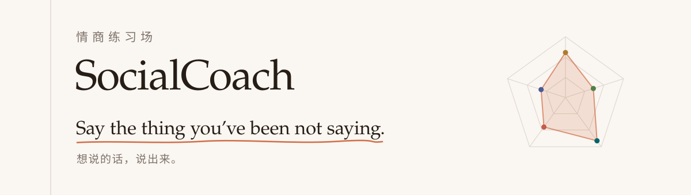
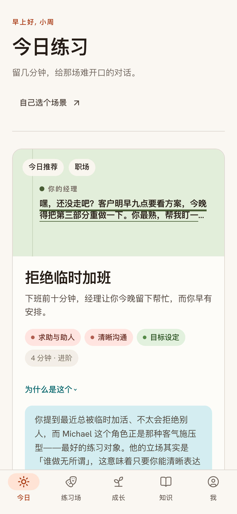
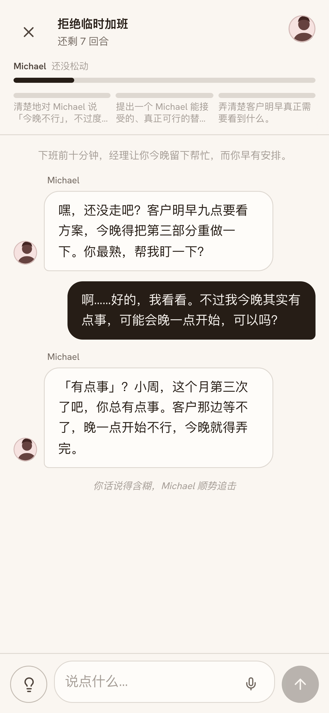
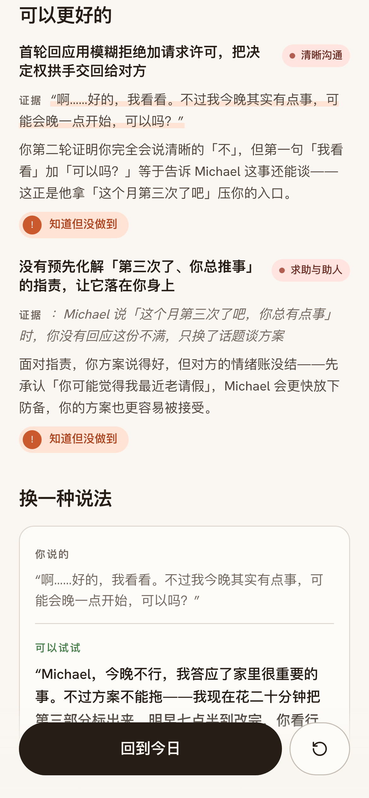
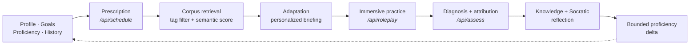

<div align="center">

<picture>
  <source media="(prefers-color-scheme: dark)" srcset="docs/banner-dark.svg">
  
</picture>

**[Try it live](https://socialcoach-app.vercel.app)** · [Quick start](#quick-start) · [Key features](#key-features) · [Architecture](#architecture) · [Paper](https://arxiv.org/abs/2606.04155)

[](https://socialcoach-app.vercel.app)
[](https://arxiv.org/abs/2606.04155)

</div>

You already know you should open with a question instead of an accusation. You know it right up until your manager sighs — and then you fold. Knowing was never the bottleneck; **reps under pressure are.** Every book, course and tips thread sells you the knowing, and most "AI role-play" apps stop at the chat.

SocialCoach gives you the other half: characters who won't hand you the win, and a coach who tells you afterwards — quoting your own words — whether you didn't know the move, or knew it and couldn't land it. Three minutes a day.

<table align="center">
<tr>
<td align="center" width="33%"></td>
<td align="center" width="33%"></td>
<td align="center" width="33%"></td>
</tr>
<tr>
<td align="center"><sub>Not another tip. A first rep.</sub></td>
<td align="center"><sub>Being polite didn't get a yes.</sub></td>
<td align="center"><sub>It shows what you said before it judges.</sub></td>
</tr>
</table>

## Key features

- **Characters who push back.** 46 bilingual scenarios across the seven places these conversations actually happen — work, family, friendship, romance, school, strangers, social occasions. Every character has their own objective and something they aren't telling you, you get a fixed number of turns, and **you can lose.**
- **A debrief that quotes you.** Every point in the report cites the line you actually said. Evidence before judgment — never a vibe score.
- **Diagnosis, not a grade.** It separates *didn't know the move* from *knew it and folded under pressure*, because the fix for those two is completely different.
- **Advice with sources.** Suggestions arrive attached to a strategy or case retrieved from a corpus of 42 strategies and 30 source-grounded cases and labelled teaching illustrations — not invented on the spot.
- **A Socratic close.** Two reflection questions, and the coach responds to what you actually answered.
- **Rehearse your real conversation.** Describe the one you actually have coming up and get a custom, fully tagged scenario in about 15 seconds — your manager, your sister, your landlord, with their real objections in their mouths.
- **It picks tomorrow's practice for you.** A skill map of 5 CASEL competencies × 34 social skills × 7 context types drives what you're served next and the radar that tracks your growth.
- **No sign-up, no database.** Everything lives on your device and exports as JSON whenever you want it.

<details>
<summary><b>Every screen</b></summary>

<br/>

| Route | What it is |
|---|---|
| `/onboarding` | 60 seconds: pick 3–5 target skills → common contexts → one line about yourself |
| `/` | Today's practice with *why this was picked for you*, streak, competency radar |
| `/arena` | Every scenario, filterable by context / skill / difficulty |
| `/practice/[id]` | Briefing → live dialogue → debrief report (one route, three phases) |
| `/rehearse` | Describe a real upcoming conversation → a custom, fully tagged scenario in ~15s |
| `/progress` | Radar, per-skill proficiency, timeline, reflection journal |
| `/learn` | The corpus as a readable library of strategies and cases |
| `/settings` | Language, model routing, export / reset your data |

</details>

## Architecture



You never get handed something off-target just to fill the slot: when nothing matches perfectly, the requirements loosen in a fixed order, and the one that matters — the skill you came to work on — never loosens at all.

The corpus and the skill map live in [`app/src/data/`](app/src/data); the six LLM routes are in [`app/src/app/api/`](app/src/app/api).

## Quick start

```bash
git clone https://github.com/GeminiLight/SocialCoach.git
cd SocialCoach/app

cp .env.example .env.local     # add LLM_API_KEY
pnpm install
pnpm dev                       # → http://localhost:3000
```

## Deployment

**ModelScope Studio:** [Open the public demo](https://modelscope.cn/studios/GeminiLight/SocialCoach). The repository-root `Dockerfile` builds `app/` and serves on port 7860; configure model credentials through Studio Secrets. See the [deployment record](wiki/specs/spec-modelscope-deployment.md).

**Self-hosted (recommended):** one small box, Docker Compose, automatic TLS. A Hong Kong or Singapore host reaches both mainland China and the rest of the world, needs no ICP filing, and sits close to domestic model endpoints.

```bash
cd app
cp .env.production.example .env.production   # fill in the key and the rate limits
$EDITOR Caddyfile                            # replace example.com with your domain
docker compose up -d --build
```

Two things that are easy to get wrong and are already handled: `.next/standalone` omits `public/` and `.next/static`, so the Dockerfile copies them explicitly; and Caddy buffers proxied responses by default, which would destroy the streamed dialogue, so `flush_interval -1` is set.

Because a public URL with a server-side key is an open LLM proxy, [`lib/rate-limit.ts`](app/src/lib/rate-limit.ts) caps calls per IP per hour and — the number that actually protects the bill — per deployment per day. Rate-limit state is in memory, so run a single instance. Set `LLM_REQUIRE_BYOK=true` to make every visitor bring their own key and spend nothing at all.

The build needs ~2 GB of RAM; on a 1 GB box build the image elsewhere and push it.

**Vercel** also works as-is — Node-runtime API routes, **no database, no auth, nothing to provision.** Set the project's Root Directory to `app` and add `LLM_API_KEY`. Note that `/api/assess` can run for a while (~40 s against a fast model) and Hobby caps functions at 60 s, and that in-memory rate limiting leaks across serverless instances.

<details>
<summary><b>Providers and model routing</b></summary>

<br/>

Anthropic and OpenAI are both supported, and `openai` covers any OpenAI-compatible endpoint — vLLM, Ollama, OpenRouter, LiteLLM, DeepSeek. Both SDKs sit behind one adapter in [`app/src/lib/llm.ts`](app/src/lib/llm.ts); the route handlers never see a provider.

A fast model handles role-play turns, hints, scheduling and scenario generation; a smart model writes the debrief.

```env
LLM_PROVIDER=anthropic         # anthropic | openai
LLM_API_KEY=
LLM_BASE_URL=                  # custom endpoint, e.g. http://localhost:11434/v1
LLM_FAST_MODEL=claude-sonnet-5
LLM_SMART_MODEL=claude-opus-5
```

Learners can also bring their own credentials (Settings → 模型). Those are stored only in their browser and the page calls the provider directly, so a learner's key never reaches the server — which is also what makes a local endpoint like `http://localhost:11434/v1` usable, since `localhost` is then *theirs*. `LLM_REQUIRE_BYOK=true` makes that the only path, so a public deployment costs nothing to run.

Provider-native variables still work as fallbacks (`ANTHROPIC_API_KEY`, `ANTHROPIC_AUTH_TOKEN`, `ANTHROPIC_BASE_URL`, `OPENAI_API_KEY`, `OPENAI_BASE_URL`). Newer OpenAI models want `max_completion_tokens` while most compatible servers only know `max_tokens` (the default) — switch with `LLM_OPENAI_TOKEN_PARAM=max_completion_tokens`.

</details>

## Tech stack

Next.js 16 App Router · React 19 · TypeScript · Tailwind v4 · Zustand (persisted) · Framer Motion · Zod · Anthropic SDK.

Mobile-first PWA (manifest + service worker). UI in Simplified Chinese and English; every model output follows the learner's language.

## Design

"**Warm paper · editorial**" — a well-thumbed communication paperback with a coach's margin notes. Paper-white ground, ink text, ochre for the one action that matters, a hue per CASEL competency. No purple gradients, no glassmorphism.

Signature moments: objective progress fills in like ink on paper; the report reads like an annotated manuscript that underlines your own words; competency growth blooms across a pentagon radar. Full brief in [`app/.impeccable.md`](app/.impeccable.md).

## Contributing

Issues and PRs welcome. The corpus is the easiest place to help: scenarios, strategies and cases live in [`app/src/data/corpus/`](app/src/data/corpus) as typed, bilingual objects with a `source` field — add one and it gets tagged, retrieved and scheduled like everything else.

## License

Copyright 2026 SocialCoach contributors.

SocialCoach is licensed under the [Apache License 2.0](LICENSE).
Third-party materials retain their respective licenses and rights; references to books, papers, and other sources do not relicense those works.

## Disclaimer

> [!IMPORTANT]
> For low-stakes practice and reflection only — **not** clinical assessment, diagnosis, or hiring decisions. Proficiency numbers are model estimates and are labeled as such in the UI. Practice data stays on your device.

## Research

This is the deployed version of a research system. The paper frames practice scheduling as cold-start, retrieval-constrained sequential decision making, builds the theory-to-practice corpus that both the scheduler and the coach read from, and separates *acquisition* deficits (you didn't know the move) from *performance* deficits (you knew it and couldn't land it under pressure) — the distinction the debrief is built on. It also covers what an app can't show you: a scheduling policy trained with trajectory-level GRPO on rubric-judge pairwise preferences, a synthetic cold-start evaluation against baselines, and human studies.

**[Read the paper →](https://arxiv.org/abs/2606.04155)**

```bibtex
@article{wang2026socialcoach,
  title   = {SocialCoach: Personalized Social Skill Learning with Agentic Tutoring and Practice},
  author  = {Wang, Tianfu and Xiong, Max and Lei, Yuxuan and Lian, Jianxun and Zhu, Hongyuan
             and Hu, Zhengyu and Gong, Linxiao and Hu, Dapeng and Li, Xiaofang and Tsai, Peiting
             and Yuan, Nicholas Jing and Zhang, Qi},
  journal = {arXiv preprint arXiv:2606.04155},
  year    = {2026}
}
```
