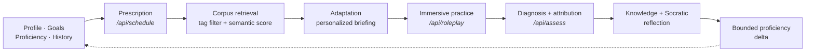

<div align="center">

<picture>
  <source media="(prefers-color-scheme: dark)" srcset="docs/banner-dark.svg">
  
</picture>

**[在线体验](https://socialcoach-app.vercel.app)** · [快速开始](#快速开始) · [核心功能](#核心功能) · [架构](#架构) · [论文](https://arxiv.org/abs/2606.04155)

**[English](README.md) · 简体中文**

[](https://socialcoach-app.vercel.app)
[](https://arxiv.org/abs/2606.04155)

</div>

你早就知道，开口应该先问一句，而不是直接指责。你也知道要沉住气——直到经理叹了口气，你还是让步了。问题从来不是“不知道”；**真正缺的是压力下的重复练习。** 每一本书、每一门课、每一个技巧帖都在卖“知道”，而大多数“AI 角色扮演”应用只停在聊天。

SocialCoach 给你的是另一半：不会把胜利拱手让给你的角色，以及一个练完之后会引用你自己原话的教练——它会告诉你，你是**不知道该怎么接**，还是**知道却没有顶住**。每天三分钟。

<table align="center">
<tr>
<td align="center" width="33%"></td>
<td align="center" width="33%"></td>
<td align="center" width="33%"></td>
</tr>
<tr>
<td align="center"><sub>不是又一条建议，而是第一次实战。</sub></td>
<td align="center"><sub>礼貌，没有换来同意。</sub></td>
<td align="center"><sub>先看你说了什么，再下判断。</sub></td>
</tr>
</table>

## 核心功能

- **会还击的角色。** 46 个双语场景，覆盖这些对话真正发生的七类情境：职场、家庭、友情、恋爱、校园、公共/陌生人、社交场合。每个角色都有自己的目标，也有没告诉你的隐情；回合数固定，**你真的会练输。**
- **引用你原话的复盘。** 报告里的每一条判断都引用你真正说过的话。先有证据，再下判断——不是凭感觉打分。
- **诊断，不是评分。** 它区分“不知道该怎么做”和“知道却在压力下退缩”，因为这两种情况的改法完全不同。
- **有出处的建议。** 建议来自 42 条策略和 30 个有来源依据的案例与教学示例，不是现场编出来的。
- **苏格拉底式收尾。** 两个反思问题，教练会根据你真正写下的回答继续回应。
- **彩排你真实要面对的对话。** 描述你即将面对的那场谈话，约 15 秒生成一个完整打标的专属场景——你的经理、你的姐姐、你的房东，带着他们真实的反对意见上场。
- **自动安排明天的练习。** 5 项 CASEL 能力 × 34 项社交技能 × 7 类情境组成技能地图，决定你下一步练什么，以及成长雷达图。
- **不用注册，没有数据库。** 一切都在你的设备上，随时可以导出成 JSON。

<details>
<summary><b>全部页面</b></summary>

<br/>

| 路由 | 说明 |
|---|---|
| `/onboarding` | 60 秒：选择 3–5 个目标技能 → 常见情境 → 一句话介绍自己 |
| `/` | 今日练习，包含*为什么给你安排这一场*、连续练习天数和能力雷达 |
| `/arena` | 全部场景，可按情境 / 技能 / 难度筛选 |
| `/practice/[id]` | 简报 → 实时对话 → 复盘报告（同一路由，三个阶段） |
| `/rehearse` | 描述一场真实、即将发生的对话 → 约 15 秒生成完整打标的专属场景 |
| `/progress` | 雷达图、逐项技能熟练度、时间线、反思日志 |
| `/learn` | 可阅读的策略与案例库 |
| `/settings` | 语言、模型路由、导出 / 重置数据 |

</details>

## 架构



你不会为了填满练习位而拿到一个不相关的场景：当没有完美匹配时，约束会按固定顺序逐步放松，而真正重要的那一个——你这次要来练的技能——永远不会放松。

语料和技能地图在 [`app/src/data/`](app/src/data)；六条 LLM 路由在 [`app/src/app/api/`](app/src/app/api)。

## 快速开始

```bash
git clone https://github.com/GeminiLight/SocialCoach.git
cd SocialCoach/app

cp .env.example .env.local     # 填入 LLM_API_KEY
pnpm install
pnpm dev                       # → http://localhost:3000
```

## 部署

**ModelScope 创空间：** [打开公开体验](https://modelscope.cn/studios/GeminiLight/SocialCoach)。仓库根目录的 `Dockerfile` 会构建 `app/` 并在 7860 端口启动；通过创空间 Secrets 配置模型凭证。部署记录见 [`wiki/specs/spec-modelscope-deployment.md`](wiki/specs/spec-modelscope-deployment.md)。

**自托管（推荐）：** 一台小机器、Docker Compose、自动 TLS。香港或新加坡的机器能同时覆盖中国大陆和全球其他地区，不需要 ICP 备案，也离国内模型端点更近。

```bash
cd app
cp .env.production.example .env.production   # 填入 key 和限流配置
$EDITOR Caddyfile                            # 把 example.com 换成你的域名
docker compose up -d --build
```

有两件容易做错、但这里已经处理好的事：`.next/standalone` 不会包含 `public/` 和 `.next/static`，所以 Dockerfile 显式复制了它们；Caddy 默认会缓冲代理响应，这会破坏流式对话，所以设置了 `flush_interval -1`。

公开 URL + 服务端 key 等于一个开放的 LLM 代理，所以 [`lib/rate-limit.ts`](app/src/lib/rate-limit.ts) 同时限制每 IP 每小时和每次部署每天的调用量——后者才是真正保护账单的数字。限流状态在内存里，所以只跑一个实例。设置 `LLM_REQUIRE_BYOK=true` 可以让每个访问者自带 key，部署方完全不花钱。

构建大约需要 2 GB 内存；如果机器只有 1 GB，建议在别处构建镜像再推过去。

**Vercel** 也可以直接使用——Node runtime API routes，**没有数据库、没有认证、无需配置任何东西。** 把项目的 Root Directory 设为 `app`，加上 `LLM_API_KEY` 即可。注意 `/api/assess` 可能跑很久（对快速模型约 40 秒），而 Hobby 计划函数上限是 60 秒；另外内存限流在 serverless 多实例之间不共享。

<details>
<summary><b>模型供应商与路由</b></summary>

<br/>

同时支持 Anthropic 和 OpenAI；`openai` 也覆盖任何 OpenAI 兼容端点——vLLM、Ollama、OpenRouter、LiteLLM、DeepSeek。两套 SDK 都封装在 [`app/src/lib/llm.ts`](app/src/lib/llm.ts) 的一个适配器后面；路由处理器看不到具体供应商。

快速模型负责角色扮演回合、提示、排程和场景生成；聪明模型负责写复盘。

```env
LLM_PROVIDER=anthropic         # anthropic | openai
LLM_API_KEY=
LLM_BASE_URL=                  # 自定义端点，例如 http://localhost:11434/v1
LLM_FAST_MODEL=claude-sonnet-5
LLM_SMART_MODEL=claude-opus-5
```

学习者也可以自带凭证（设置 → 模型）。这些凭证只存在浏览器里，页面直接调用模型供应商，所以学习者的 key 永远不会到服务器——这也是 `http://localhost:11434/v1` 这类本地端点可用的原因，因为此时 `localhost` 是*他自己的*。`LLM_REQUIRE_BYOK=true` 会让自带 key 成为唯一路径，这样公开部署的运营成本为零。

供应商原生环境变量仍然可以作为回退（`ANTHROPIC_API_KEY`、`ANTHROPIC_AUTH_TOKEN`、`ANTHROPIC_BASE_URL`、`OPENAI_API_KEY`、`OPENAI_BASE_URL`）。较新的 OpenAI 模型需要 `max_completion_tokens`，而大多数兼容服务器只认识 `max_tokens`（默认值）——可以用 `LLM_OPENAI_TOKEN_PARAM=max_completion_tokens` 切换。

</details>

## 技术栈

Next.js 16 App Router · React 19 · TypeScript · Tailwind v4 · Zustand（持久化）· Framer Motion · Zod · Anthropic SDK。

移动优先 PWA（manifest + service worker）。界面支持简体中文和英文；所有模型输出都跟随学习者的语言。

## 设计

“**温暖纸张 · 编辑排版**”——一本翻旧了的沟通平装书，页边留着教练批注。纸白底、墨色字、赭石色只留给最重要的那个动作，每项 CASEL 能力有自己的色相。没有紫色渐变，没有玻璃拟态。

标志性瞬间：目标进度像墨迹在纸上慢慢填满；报告像一份带批注的手稿，先划出你自己的原话；能力成长在五边形雷达上展开。完整设计说明见 [`app/.impeccable.md`](app/.impeccable.md)。

## 参与贡献

欢迎提 Issue 和 PR。最容易参与的地方是语料：场景、策略和案例都在 [`app/src/data/corpus/`](app/src/data/corpus) 里，是带 `source` 字段的、类型化的双语对象——新增一条，它就会像其他内容一样被打标、检索和排程。

## 许可证

Copyright 2026 SocialCoach contributors.

SocialCoach 使用 [Apache License 2.0](LICENSE) 许可。

第三方材料保留各自的许可证和权利；对书籍、论文及其他来源的引用不代表对这些作品重新授权。

## 免责声明

> [!IMPORTANT]
> 仅用于低风险练习和反思——**不用于**临床评估、诊断或招聘决策。熟练度数字是模型估计值，界面中已明确标注。练习数据留在你的设备上。

## 研究

这是论文研究系统的部署版本。论文把练习排程建模为冷启动、受检索约束的序列决策问题，构建了排程器和教练共同读取的“理论 → 实践”语料，并区分*acquisition*缺陷（不知道这一步）与*performance*缺陷（知道，但在压力下做不出来）——复盘正是建立在这个区分上。论文还覆盖了 App 无法展示的部分：用 trajectory-level GRPO 和 rubric-judge 成对偏好训练的排程策略、针对基线的合成冷启动评测，以及用户研究。

**[阅读论文 →](https://arxiv.org/abs/2606.04155)**

```bibtex
@article{wang2026socialcoach,
  title   = {SocialCoach: Personalized Social Skill Learning with Agentic Tutoring and Practice},
  author  = {Wang, Tianfu and Xiong, Max and Lei, Yuxuan and Lian, Jianxun and Zhu, Hongyuan
             and Hu, Zhengyu and Gong, Linxiao and Hu, Dapeng and Li, Xiaofang and Tsai, Peiting
             and Yuan, Nicholas Jing and Zhang, Qi},
  journal = {arXiv preprint arXiv:2606.04155},
  year    = {2026}
}
```
