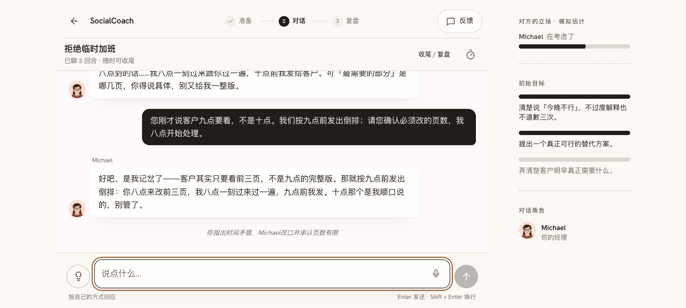
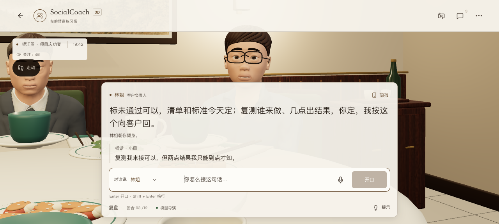

# 个人模型接入验证 · 2026-10-06

基于主站 `origin/main`（2d64255）修复，在隔离浏览器中使用合成档案。用户密钥不在本目录、提交或日志中，未改网站默认模型、共享预算或用户真实档案。

## 原始现象与根因

1. 生产站 3D 配置 `ling-3.1-flash` 后报网络连接失败。相同浏览器、地址、密钥：普通认证 GET `/models` 返回 200，增加 `X-Stainless-Lang` 后 `Failed to fetch`。网关 CORS 允许常规认证/JSON 请求头，但不允许 OpenAI SDK 自动附带的 `X-Stainless-*` 诊断头。
2. 去掉诊断头后，3D 两轮真实回复成功，2D 首轮通过一次格式修复成功，第二轮仍失败。修复请求 HTTP 200，但 `content` 为空，`finish_reason=length`，输出消耗 1,800 token；只存在推理内容。记录只保存推理字符数量，丢弃推理文本。网关接受 `thinking:{type:"disabled"}`，独立生成验证有正文且推理字符为 0。
3. 默认共享模型的失败另有来源：当天共享预留量 1,982,532 / 2,000,000，剩余 17,468，不够一次真实对话的保守预留。此数字是共享应用预留量，不能证明提供商钱包余额耗尽。网站 `/models` 检查成功也不能解除此预算约束。原始线上证据另存 [共享预算检查](../online-budget-2026-10-06/README.md)。

## 修复

- 浏览器 OpenAI 客户端删除可选 `X-Stainless-*` 诊断头；保留认证、正文、取消信号和 SDK 重试。
- 个人模型增加“短对话关闭额外推理”可选设置，默认关闭。仅在用户启用且任务声明 `thinking:false` 时传禁用推理字段；普通官方配置、旧配置和其他任务保持原请求形状。设置只留设备，纳入配置身份及检查失效判断，切换服务商时重置。
- 不使用代理转发个人密钥，不修改 API 或练习档案格式。

## 验证结果与边界

- 两个回归测试先失败再通过，覆盖 SDK 元数据、非流式/流式生成、认证/正文/取消保留、旧设置、默认设置和选择性关闭推理。
- 完整 `pnpm check`：24 个核心测试、231 个 3D 测试及已有核心检查通过；末轮测试清理后 lint、类型和专属回归再通过。生产构建通过。
- 修改后的真实浏览器 + 同一网关：2D 续聊与纠正时间矛盾两轮分别约 2.38 / 3.20 秒，均流式一次成功，推理字符 0；3D 继续指定对象、讨论未通过项目和上线边界约 3.86 秒，一次成功，推理字符 0。两模式刷新后使用保存的设置。
- [2D 指标](./2d-short-reply-metrics.json)、[3D 指标](./3d-short-reply-metrics.json)、[原失败指标](./2d-reasoning-exhaustion.json)、[合成转录](./synthetic-dialogues.json)、[连接生成](./connection-generation.json)、[推理选项检查](./reasoning-option-check.json)。原流式响应正文未被浏览器保留，字段标为未知；非流式修复的空正文/输出上限证据已保留。
- 原问题在生产页面复现；修复后的浏览器测试使用本地构建、真实远端模型。尚未以生产发布声称验收。短样本仅证明此连接链路可用，不能证明任意场景语义质量、全部模型或设备性能。一次回复把九点说成十点，后续纠正恢复；该语义问题不被连接成功掩盖。
- 终端 Node SDK 直连探针两模式各 35 秒超时，未作为浏览器链路结论；实际浏览器的认证、流式和非流式均已验证。

Skill evolution：无需更新通用技能；网关兼容性与推理预算的证据留在项目。

