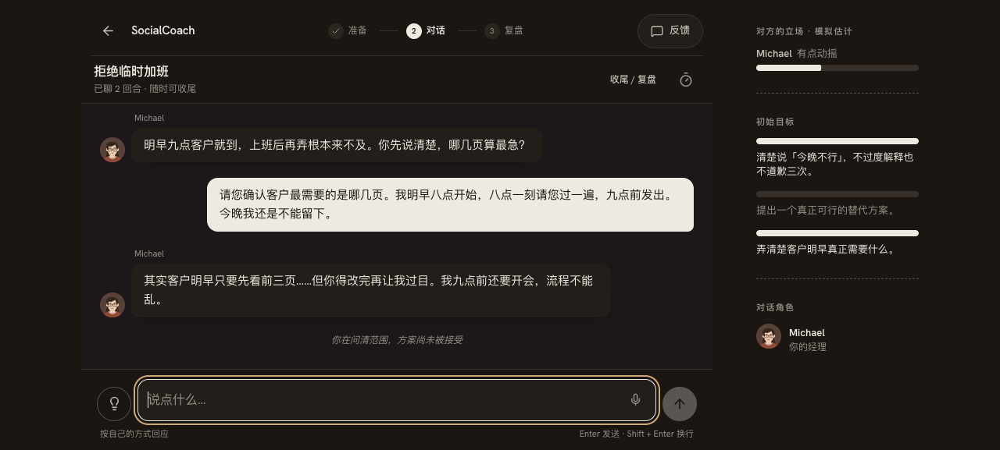
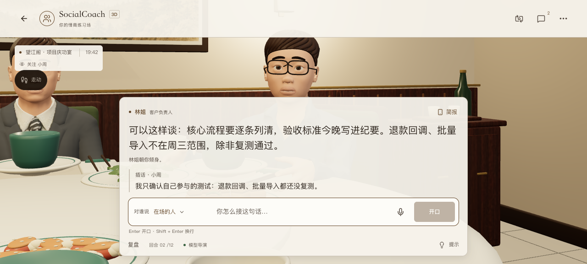

# 全站默认模型发布与共享额度恢复 · 2026-10-06

用户批准将所提供的模型作为全站默认，并额外开放今天至多 2,000,000 个共享预留 token。Vercel 与 ModelScope 正式服务均改为 OpenAI 兼容网关 `https://tokendance.space/gateway/v1`，fast / smart 都为 `ling-3.1-flash`，token 参数 `max_tokens`，短任务关闭额外推理。密钥仅写平台 Secret，不进入客户端、提交或本原件。

## 发布与边界

- PR #12 合并为应用提交 `c800aa2`；GitHub main 的应用质量检查成功。Vercel 生产 `dpl_C7zNjd1nkvSuCEZ9MgmqFa9hBW7V` Ready，正式 `socialcoach-ai.vercel.app` / `socialcoach-app.vercel.app` 已关联。新配置先写入生产环境，再触发合并部署。
- ModelScope `2970d13`：白名单同步应用源代码 / 资源 / 配置 / 构建脚本 / 测试共 371 文件，逐项 SHA256 与发布源一致；只有六个应用文件新增或修改。Docker 执行 `pnpm check && pnpm build`，成功镜像 `363578-2970d13c-2026-10-06-18-43-05`，空间 Running，免费 2v CPU / 16g 与公开性保持原设置。
- 未同步论文材料、环境文件、本地生成缓存或未合并的其他 PR。没有改变练习存储 / 导出或引入账号。匿名预算服务不存提示、档案或密钥。

## 一次性预算恢复

两站使用同一数据库。操作前原保守预留为 1,982,532 / 2,000,000、活跃调用为 0。原子脚本验证 UTC 日期、限额和无活跃调用，将当天可用池恢复到 2,000,000；实际增加的可用预留量为 1,982,532，低于授权上限。每日上限仍为 2,000,000，并发上限仍为 8。

原计数和恢复时间保留为 30 天匿名审计；日期专属标记保证重试不能再次恢复。六次真实默认生成之后重试操作返回“已执行”，使用量 456,096 前后相同，未再次清零。全部对话检查后使用量为 599,199、活跃为 0，剩余 1,400,801。此处是保守应用预留量，不是供应商账单 token 或钱包余额。UTC 日界仍对应北京时间次日 08:00；本次不是取消每日保护，也没有增加供应商余额。

## 实际验证

- Vercel / ModelScope 的 2D、3D 四条正式默认接口都返回真实模型结果：HTTP 200，没有 quota / 连接错误；耗时约 8.98 / 6.66 / 3.40 / 2.74 秒。调用不使用客户端个人密钥，不重发失败的生成。
- Vercel 正式网页：隔离合成档案、个人密钥为空，3D 两轮从拒酒接续到交付范围；文字两轮拒绝加班并问清页数。完整 NPC 回复已写入本地档案，界面无关键错误。统计请求被拦截，没有发送产品反馈或读取真实用户档案。
- ModelScope 专用认证 API 已验证；国内公开入口在本次网络中仍有独立访问问题：直接网页 `net::ERR_CONNECTION_CLOSED`，不带 SDK token 的直接 GET 仍返回 403；平台展示页能加载，但应用 iframe 未加载。这不是生成额度证据，不能把 Running / 专用 API 成功当作公共浏览器验收通过。使用正式主站链接可访问本次已验证对话。公开入口问题沿既有记录继续跟进。
- 这是连接与短对话验收；没有将少量合成对话扩写为任意场景、复盘语义或真实手机性能保证。

[发布摘要](./release.json)、[四接口原件](./api-results.json)、[默认网页转录](./browser-synthetic-dialogues.json)、[首次恢复](./budget-restoration.json)、[幂等重试](./budget-idempotency.json)、[检查后预算](./budget-after-checks.json)、[国内构建摘要](./modelscope-build-summary.json)。

