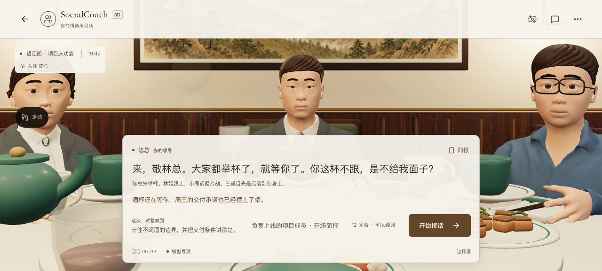

# PR #11 合并与发布核验 · 2026-10-06

用户要求检查并合并合理的剩余 PR。唯一开放项为 NPC 精修 #11；模型接入 #12 已合并。复核 source、调用方、私有快照 / 旧档边界、显示层与正常回合调用量，确认一条有效 P2：提及 `原话` / `repeat` / `quote` 的复读投诉被误认为请求复述。

四条中英投诉反例先失败；改为明确请求识别、分句排除投诉 / 否定后通过，同时保留中文复述、中英否定、两种英文明确请求及“先问原因再要求复述”。不放宽已显示内容一致性，不改变玩家当前输入或转录，不增加正常回合模型调用。其余未定位的旧英文流中断继续保留。

合入当前 main 后，lint / 类型、24 个核心与 248 个 3D 测试、既有核心检查及正式构建通过；增加一条请求边界后专属 17 项、lint 再通过，PR 的远端完整 249 个 3D 测试及预览构建成功。审查 head `4c9aab1` 合并为 `929bb0c`，开放 PR 数为 0。

Vercel 生产 `dpl_5KrwcrE4kvuUzUVj2VjY9JcQnY2m` Ready，正式别名已关联；浏览器 `/3d` 有真实内容、三位人物都有双语私有口吻快照，未配置个人密钥，无关键页面错误。ModelScope `0a5cc06`，375 个必要产品构建文件与源逐项哈希一致，Docker 完整检查 / 构建成功、空间 Running。没有上传论文、环境文件或凭据，没有改免费硬件、模型配置或共享预算。

主线 CI 首轮在未改动的 Hanken Grotesk 字体模块解析失败，错误为 `next/font/google queries have exactly one entry`；相同源码第二次完整检查 / 构建通过。PR 检查、本地构建、Vercel 与国内 Docker 构建也成功；这不足以定位首轮字体错误的具体原因，原失败摘要保留，未用更改或跳过检查掩盖。

本次新默认模型的合并后生成探针第一条被 HTTP 429 quota 拦住，停止后续生成。只读预算确认为 1,988,247 / 2,000,000，余 11,753、活跃 0，今日已恢复标记存在；剩余量低于即使空输入也需预留的 17,388（3D）/17,688（文字）。生成未到供应商，不宣称新 Ling 付费回放通过。预算没有再次清零、没有绕过保护。次日北京时间 08:00 为 UTC 日界。旧模型的前后对照与网页记录另存此前证据目录。

[合并 / 部署摘要](./summary.json)、[实际被拦探针](./live-probe.json)、[只读预算](./budget-read.json)、[首轮构建错误摘要](./first-build-error-excerpt.txt)。

