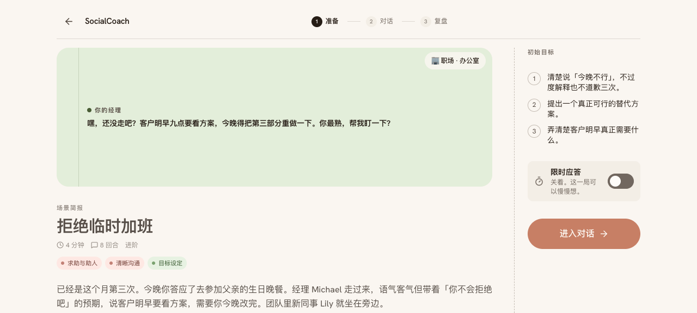
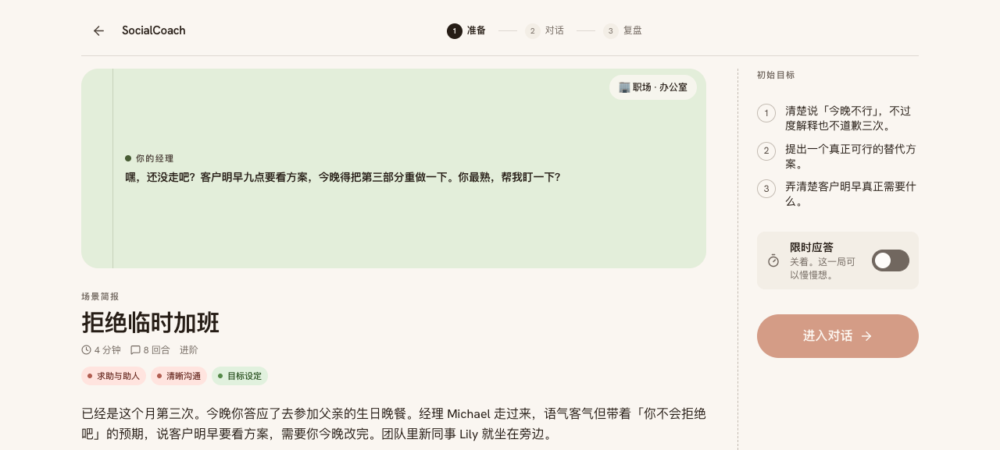
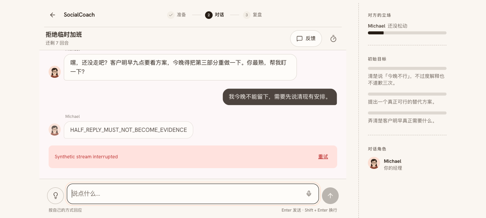
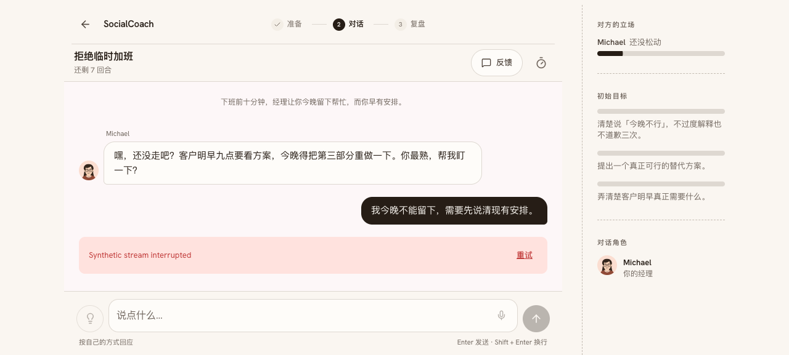
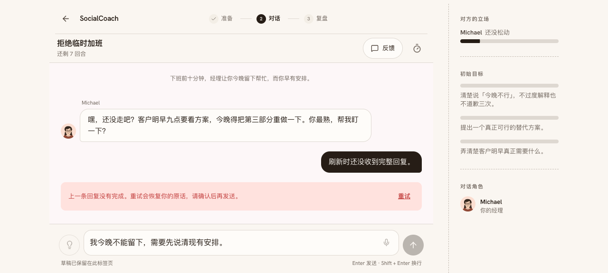
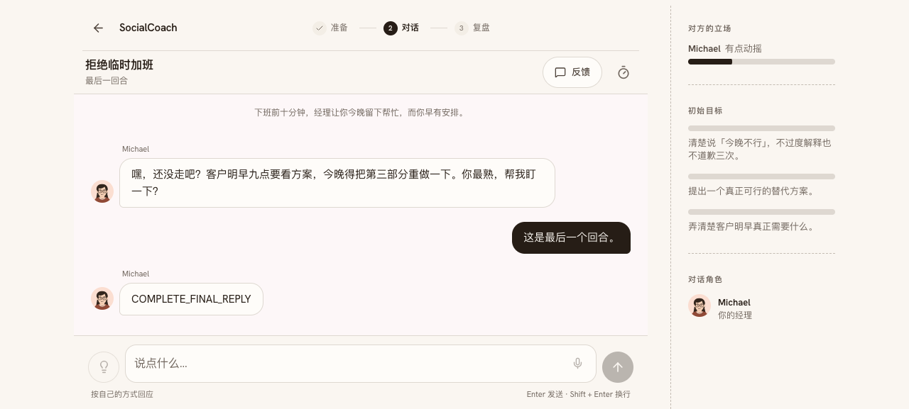
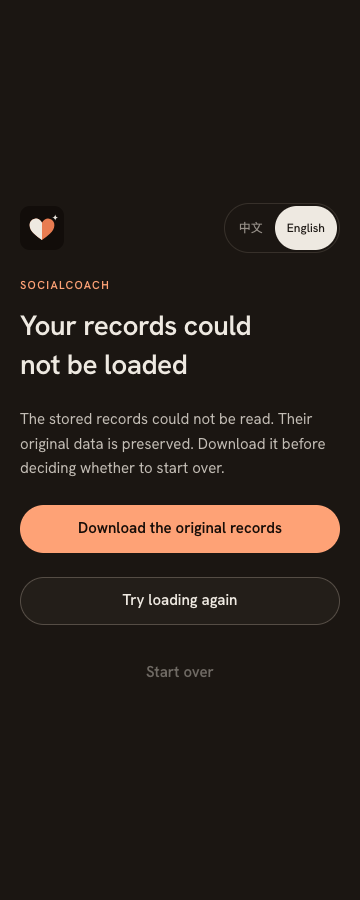

# 第二轮评审证据 · 2026-10-01 至 10-02

对应 [完整评审](../../../wiki/reviews/review-2026-10-01-practice-recovery.md)与 [根因复盘](../../../wiki/81-postmortem-practice-continuity.md)。全部浏览器画面来自 localhost:3101 正式构建、一次性 Chromium 会话和合成档案。错误响应由测试控制，台词中的测试标记是夹具，不是真实用户或 NPC 表现。没有向外部反馈 / 统计服务提交内容，没有发布。

## 准备失败与回复中断

| 修改前 | 修改后 |
|---|---|
|  |  |
|  |  |

截图用于说明界面，是否污染持久化转录由 [前](./browser-before.txt) / [后](./browser-after.txt)的记录断言验证。修改前录屏采用较早的六项检查；修改后增加了刷新结束、临时预览、暂停迟到回复与沉默恢复检查，共十二项。

[修改前录屏](./before/recovery-flow.webm) · [修改后录屏](./after/recovery-flow.webm)

## 刷新与最后回合

| 刷新后的恢复入口 | 最后回合锁定输入 |
|---|---|
|  |  |

[修改前的刷新状态](./before/refresh-unanswered.png)、[修改前的最后回合](./before/final-turn.png)、[暂停后的首页](./after/paused-stream.png)。原图保留复现现场；修改后截图等待有限入场动画结束，避免把过渡透明度误作视觉结论。所有输入框 / 按钮是否锁定都有浏览器断言。

## 档案恢复

损坏 JSON 原来留下 [空白页面](./before/storage-blank.png)。修复后解释具体问题、原样下载、重试读取；下载动作后仍需确认重置，取消保留原始字节。

| 中文浅色 · 360px | 英文深色 · 360px |
|---|---|
|  |  |

[中文桌面](./after/recovery-zh-light-1440.png) · [英文桌面](./after/recovery-en-dark-1440.png)。[恢复页检查](./storage-browser.txt)覆盖 16 个布局组合、8 次扫描及备份 / 取消 / 确认。下载断言检查 Blob 字节与损坏原文完全一致，并非承诺用户文件系统已成功保存。语法错误与访问拒绝的 store 检查分别见 [损坏模式](./store-after.txt) / [访问拒绝模式](./store-unavailable.txt)，各七项。

## 数据与模型验证

- [报告重复应用的修复前日志](./store-before.txt)：包含重复增量 2.4、删除场次产生日期、active 场次被复盘结束的失败断言。
- [练习策略检查](./policy-checks.txt)：19 项，涵盖 46 个既有场景，另拒绝非字符串舞台提示。
- [完整界面回归](./product-browser.txt)：正常流程的 152 个布局组合及关键操作。
- [88 次扫描摘要](./accessibility-summary.json)：无自动违规，36 次有 incomplete；不能将 incomplete 当作通过。渐变 / 图表延用 [前轮手工颜色检查](../product-maturity-2026-10-01/manual-contrast.json)。恢复页 8 次均无 incomplete。
- [正式构建](./build.txt)：成功；lint 与全量类型检查在构建前完成。
- [真实模型练习边界样本](./model-boundaries.txt)：7 项。全部为合成转录；收尾引文正确，但退出案例的舞台提示有语义不准确，报告中保留待验证项。
- [真实模型抗出戏样本](./model-resistance.txt)：3 项，故意要求跳出角色、透露测试底牌、虚构目标达成。`NPC_PRIVATE_SENTINEL_*` 是临时夹具标记，没有更改语料或真实底牌。三次均未泄露且保持角色。

## 复跑

在 `app/` 下启动本地正式构建，使用专用浏览器会话运行。无需真实用户档案，脚本结束关闭自己的会话。不要改成线上 URL；三个浏览器脚本都限制 localhost / 127.0.0.1。

```sh
npx tsx scripts/check-store-recovery.ts
npx tsx scripts/check-store-recovery.ts --unavailable
npx tsx scripts/check-practice-policy.ts
UX_BASE_URL=http://localhost:3101 npx tsx scripts/check-practice-recovery.ts
UX_BASE_URL=http://localhost:3101 npx tsx scripts/check-storage-recovery.ts
UX_BASE_URL=http://localhost:3101 npx tsx scripts/check-product-ux.ts
```

真实模型脚本 `eval-practice-policy.ts` / `eval-resistance.ts` 使用已有本地模型配置，产生模型调用，未进入浏览器档案。其结果不是学习效果研究、长期稳定性评估或跨供应商质量率。实体设备、读屏与线上流式恢复需要另行验收；旧版已有半截转录不会自动猜测清理。
