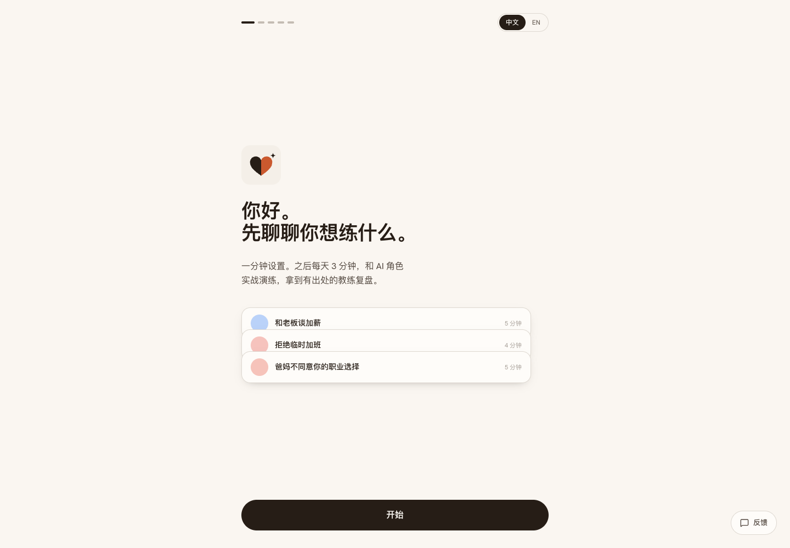
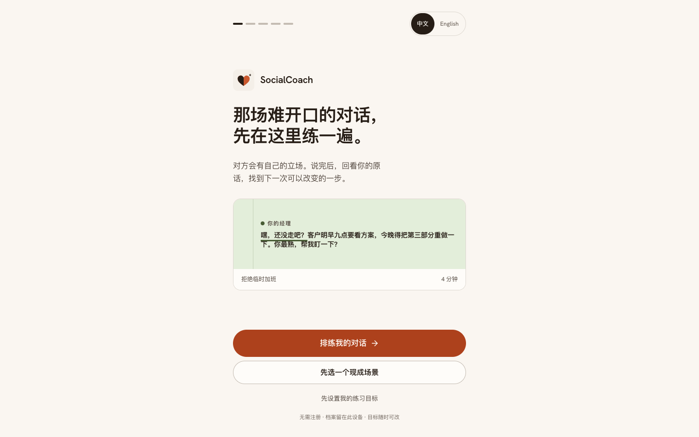
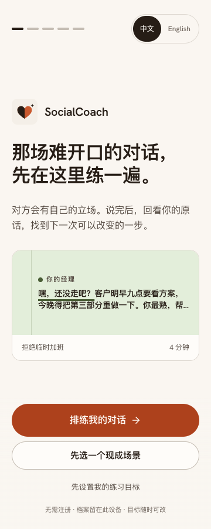
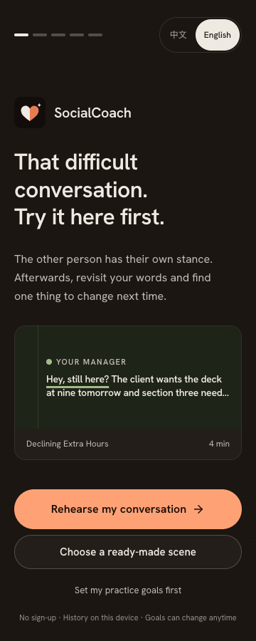
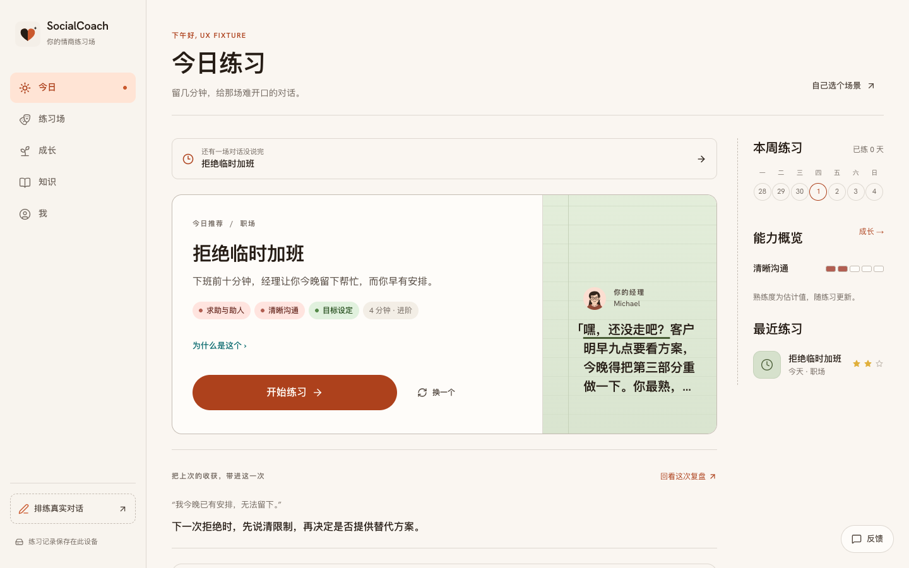
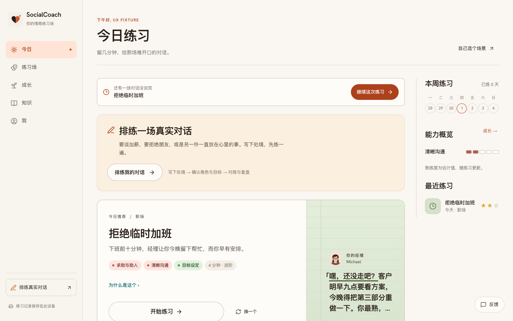
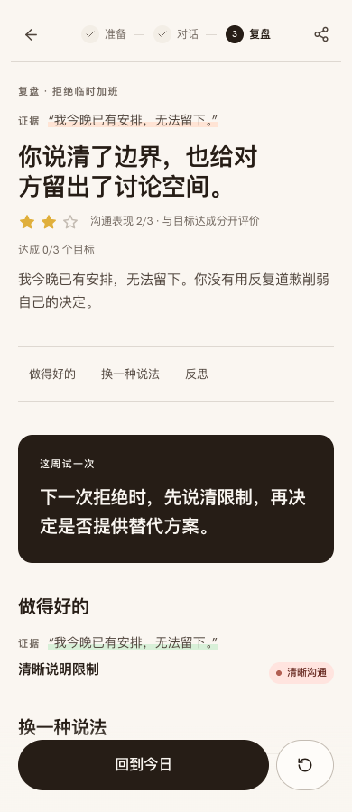
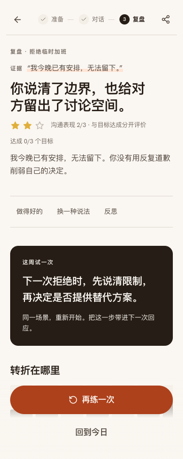
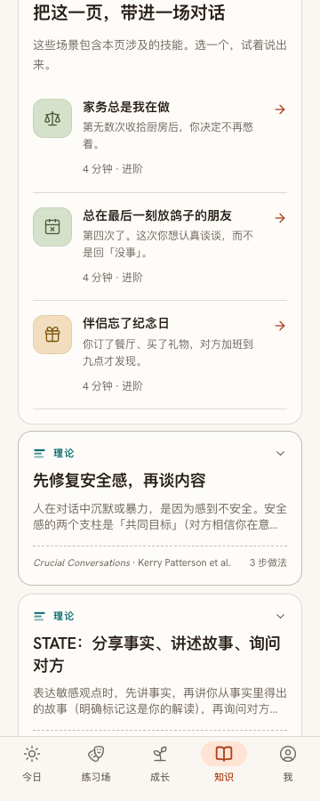

# 产品成熟度评审证据 · 2026-10-01

对应 [完整评审](../../../wiki/reviews/review-2026-10-01-product-maturity.md)。所有截图来自本地正式构建，未部署。欢迎页为空档案；首页 / 复盘使用标为 `UX Fixture` 的合成数据，不是真实用户或真实模型输出；知识内容来自既有语料。模型请求在回归中被拦截，截图只用于界面验收。

## 欢迎页：从设置转向开始练习

桌面对照使用相同 1440px 视口。

| 修改前 | 修改后 |
|---|---|
|  |  |

手机浅色 / 英文深色，均为 360px。

| 中文浅色 | 英文深色 |
|---|---|
|  |  |

## 首页：续接与真实处境优先

1440px，相同本地合成场次。

| 修改前 | 修改后 |
|---|---|
|  |  |

## 复盘与知识：把下一步接到实际练习

复盘合成夹具只用于检查操作层级；修改前为 390px，修改后为 360px，不能作为同宽像素差异比较。完整对话与模型点评需另做真实验证。

| 原复盘 · 390px | 新复盘 · 360px | 知识关联场景 · 360px |
|---|---|---|
|  |  |  |

[桌面知识页](./learn-after-1440.png)保留左右阅读结构；相关练习在正文与来源之后。

## 验证记录

- [浏览器回归日志](./browser-regression.txt)：152 个页面 / 视口组合，以及快速入口、完整设置、知识到练习、保留旧报告的重练、恢复与焦点等行为。
- [80 次自动扫描摘要](./accessibility-summary.json)：中英 / 明暗 / 两端视口；自动违规为 0，36 次含需人工核对的对比度项目。保留对应元素、原因和规则，不将它们自动判为通过。
- [人工颜色补查](./manual-contrast.json)：从实际浏览器 CSS token 转 sRGB，按相对亮度计算；覆盖图表文字、批注、知识计数、NPC 气泡与本轮场景封面。没有覆盖所有产品子状态。

语义效果、学习改善、iOS / Android 软键盘、真实读屏与线上流式接口不在本次自动回归结论中。
