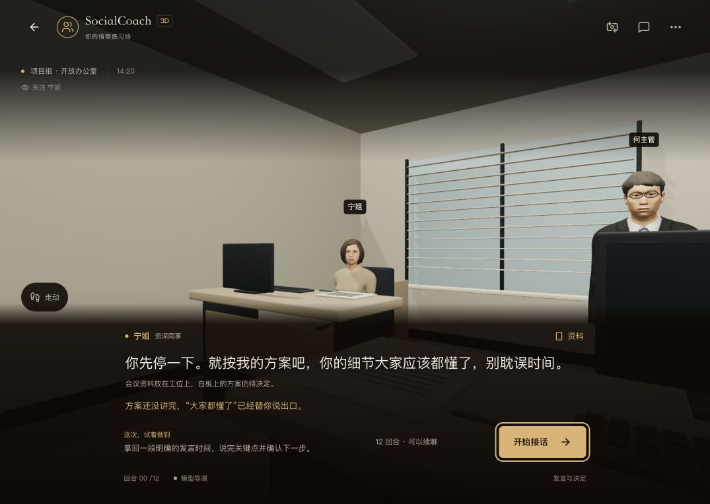

# 现有场景剧情回放 · 2026-10-04

全部输入是合成玩家发言，模型为部署当前配置的 `glm-5.3-flash`，没有读取用户浏览器档案或音频。没有换用未经验证的新模型。

- `3d-accepted.json`：十个开局的 123 次接受回复，九个开局 12 回合，敬酒开局跨段继续到 15。来源是最终矩阵中的八个案例，以及敬酒 / 办公室加活两次针对性复测；**不是十个案例一次性全绿**。
- `3d-varied-inputs.json`：五种空间各一条非标准中文路线和一条英文路线，共 40 次回复。
- `text-continued.json`：三条文字路线各 14 回合，加 12 个新语料开局，共 54 样本。结构 issues 为空；两次模型建议收尾，但用户仍能继续。
- `3d-matrix-before-event-normalization.json`：保留敬酒第一回合因重复请求开场举杯而失败的矩阵原件，其他九个案例通过。
- `office-before-topic-normalization.json`：保留办公室把 `priority` 同时放进 topic / beat、修复后仍无效的案例。
- `measurements.json`：接受的主矩阵回复耗时中位数 4252 ms、最长 8920 ms。合成会话共用服务且经历不同负载，不据此声称比旧版快或代表真实手机性能。

回放不代表完整网页旅程：本地生产网页能展示短开场，曾实际发送敬酒第一句；之后测试点击不生效，新开局发送前也相同，浏览器连接随后超时。连续发送、历史、手机和线上画面的本轮复核未通过。见项目评审的范围与局限。

结构通过不等于语义永远正确：文字回放仍出现把帮助移到报告截止之后、3D 一些人物迅速让步或反复确认未定负责人等偏差。保留原件，不以接受数当作真实用户兴趣、留存或通关率。

`release-check.json` 保存两端各两轮合成在线请求与资源状态。Vercel 为公开主站，国内为 ModelScope 专用认证 API；不含凭证，不是公共 iframe 或实体手机验证。

## 文字帮忙时间复测

- `text-facts-first-matrix.json`：第一版检查后的 54 个样本，结构 issues 为空，但第 8 轮仍把自己的报告截止转成“16:30 前帮忙”。另有 1 次修复，不能标语义全通过。
- `text-facts-before-sequence-check.json`：针对性 15 个样本仍漏过“忙自己的报告，完了只看”和“之后也只帮”。保留原件，没有用结构成功掩盖偏差。
- `text-facts-final.json`：补上实际复现形式与双语事实边界后，中文同一局连续 14 轮，加英文入口，共 15 个样本。结构 issues 为空、无修复调用；人工阅读第 8 / 14 轮保留自己的报告期限，没有设定帮忙时间。第 10 / 14 轮模型建议收尾，仍不自动结束练习。

新增 10 项事实 / 预览 / 修复检查；既有 47 项文字检查、lint 和生产构建通过。以上 84 次样本与原先 217 条接受回复分别记录，不合并成一次全绿回放。最终样本第 12 轮仍把未执行的逻辑讨论说成“把过关”，其他轮次出现无根据的细节；时间保护不等于通用事实保证。网页连接依旧超时，连续浏览器试玩未补齐。

`facts-release-vercel.json` 保存本次公开主站的页面 / 资源与两轮合成文字请求。回复确认报告截止归属及帮忙时间未约定；第一轮约 26.9 秒、第二轮 8.4 秒，是单次在线样本，不能宣称性能改善。即使时间正确，其他私有信息揭示与角色事实仍需另外校验。

`facts-release-mirror.json` 是本次国内专用认证 API 的对应核对：页面 / health 200、16 个引用资源全 200；两轮约 4.1 / 6.8 秒，第 2 轮同样确认帮忙时间未定。与主站不同的负载、入口和网络，不能用这两轮比较站点性能。没有测试公共 iframe 或真实手机，也没有读取用户档案。

## 私有知识与透露条件

- `disclosure-before-private-anchor.json`：第一次具体条件优先的回放，同时用旧提示两处替换作对照，共 28 记录。旧提示学校首轮格式失败后该路径停止；当前 15 回复接受。模型波动、轨迹和负载不同，不宣称统计改善。
- `disclosure-current-with-format-failure.json`：进一步标清固定模拟器知识仍受透露条件限制，共 16 记录；学校第一轮再次格式失败，没有写入接受历史，其余五路线各 3 回合。
- `disclosure-cast-targeted.json`：学校路径完整针对性重跑 3 回合；本次未复现格式失败。没有在证据不足时加入角色别名纠正。
- `disclosure-accepted.json`：后两份材料中的 18 条接受回复，标明拼接来源，**不是六路线一次全绿**。路线覆盖工作中英、家庭中文、学校中文、伴侣英文及线上承诺追问的复现。

人工阅读：边界 / 礼貌首轮没有完整交代限定底牌，相关反馈 / 担忧追问后才说；后续仍保留具体争议，没有因为发现底牌自动答应。局限：有无依据的时钟、亭子、过去事件，且 revealed 重复 / 漏标；结构接受不等于语义通过。57 项既有文字检查、lint / 正式构建通过。连续网页试玩依旧受浏览器连接超时阻碍，尚不能确认新提示的实际可玩体验。

`disclosure-release-vercel.json` / `disclosure-release-mirror.json` 保存两端的新提示上线核对，各有两轮合成文字对话：先纠正 NPC 擅自安排，再询问原始反馈；revealed 为 false → true。两端 `/3d` / health 与各 16 个引用资源均 200。国内仍是专用认证 API，第二句还错误说成“方案三”，实际是两种方案、第三页；这些记录不能证明事实全正确或公开 iframe 可用。

## 实际网页控制的当前状态

直接绑定已有本地标签页后，读页 / 截图恢复；全应用总览入口仍超时。隔离正式构建 `localhost:4363` 的办公室开场可见，但“开始接话”没有产生状态变化。按钮启用、无 inert、中心命中 BUTTON、页面 visible、pointer-events 为 auto，无弹窗或控制台警告 / 错误。按元素、DOM 角色、键盘 Enter 和已核对位置的鼠标操作都未进入输入框；键盘能改变焦点。显示浏览器窗口也没有解决。源码按钮只是 setStarted(true)，未发现足以归因的重置逻辑；不能据此确定是产品故障还是控制链路问题。

没有加入绕过开始按钮的测试入口，没有执行页面内部函数或改写档案。用户原有 4362 页保留；隔离 4363 页和测试服务为后续诊断保留，只含此前创建的合成现场。已请求一次人工点击确认；答复尚待收到。当前截图只证明开场渲染，不证明连续交互：

