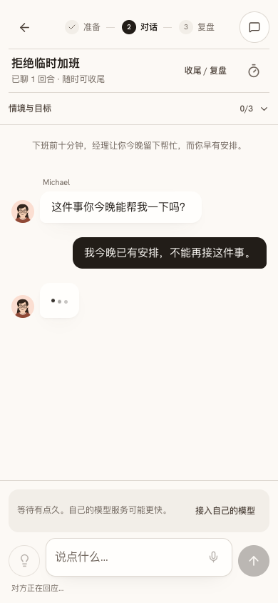
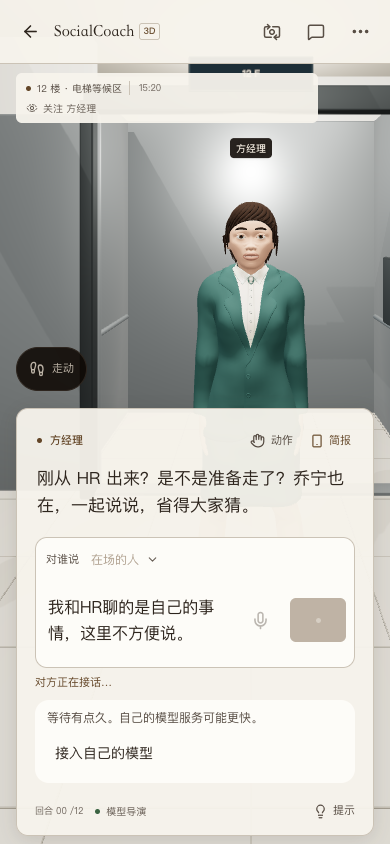
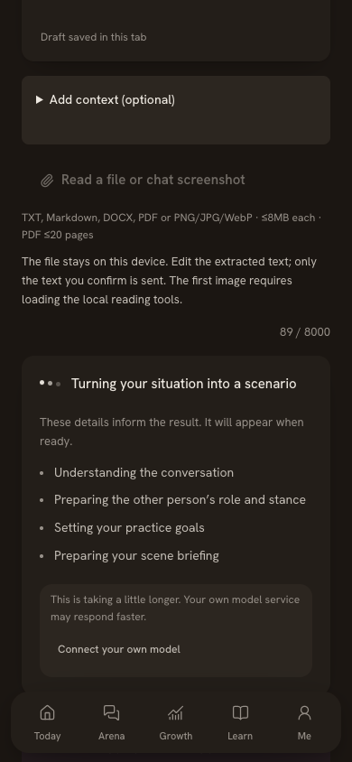

# 默认模型等待提醒 — 2026-10-08

默认模型处理较久时，用户需要看见一个直接、可选的接入入口。此前只在部分等待界面提供入口，且排练和复盘分别要等 40、60 秒；对话和 3D 缺少同样的处理。

现统一在请求待完成约 8 秒后，在当前回复附近显示「等待有点久。自己的模型服务可能更快。」和「接入自己的模型」。点击打开原配置窗口，当前请求与原处境保留，不重发；新设置用于之后的请求。个人模型、快速回复、模型明确不可用时不重复推荐，完成或取消后移除。真实故障继续走原错误提示与接入恢复。

覆盖排程、场景准备、排练、文字对话／提示、复盘／反思／咨询、成长模式与 3D 对话。中英文一致，3D 尊重当前现场语言并使用其对话面板颜色。没有新增自动弹窗、模型调用、账号、服务端练习存储或动画。

验证：

- 浏览器先复现原入口没有在 8.5 秒出现，再验证新提示、接入窗口、保留原处境、无重复请求以及完成后清理。见 [timing-check.json](./timing-check.json)。
- 快速请求完成后继续等待超过 8 秒没有旧计时器提示；个人模型实际进入受控请求后仍不推荐。见 [no-noise-check.json](./no-noise-check.json)。
- 手机文字聊天提示在输入区附近、原话保留、无横向溢出；局部 axe 无违规。见 [chat-check.json](./chat-check.json)。
- 手机 3D 中文和排练英文深色界面各自一条入口，无横向溢出，局部 axe 无违规。截图见下方。浏览器模拟仅验证等待体验，没有付费推理，不作为提供商速度或真实手机性能证据。
- 原有 29 核心、249 3D 检查通过；最终 lint、类型检查和生产构建通过。

发布状态和来源提交记录在 [release.json](./release.json)。方案见 [等待提醒](../../../wiki/archive/specs/spec-slow-model-reminder.md)。
