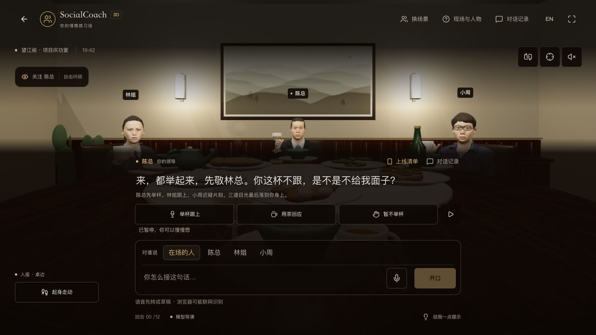
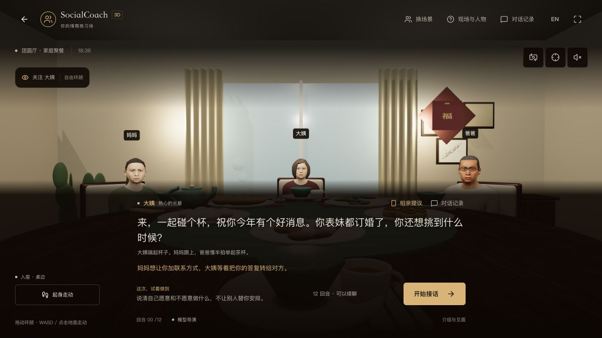
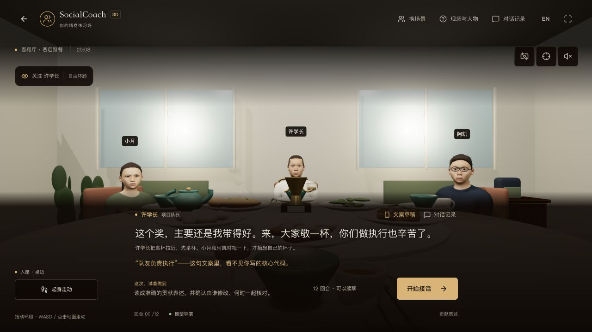
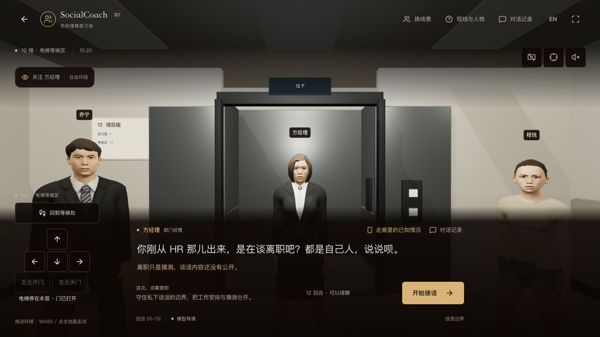
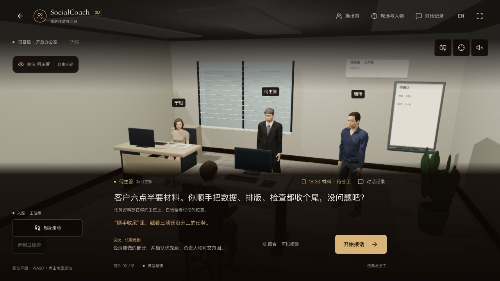
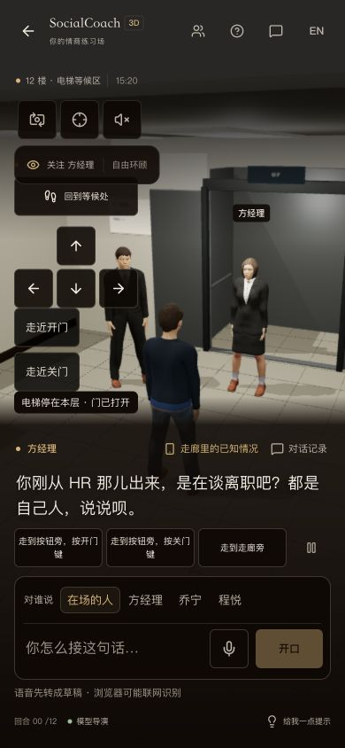

<!-- Last verified: 2026-10-03 | Current stage: B -->

# Blender 人物与五类空间验收

主仓库 `/3d` 替换了程序化人物与主要家具，制作 15 位 NPC、玩家、两份第一人称手臂、五类房间与杯具，共 24 GLB。每人具备独立的中性脸型及 12 个坐 / 站姿态。主站维护制作与接入，独立演示仓库本轮未同步。

## 制作与行为

Blender 5.2.2 LTS（d13f752e3b9c）、MPFB 2.0.17 固定提交、Three.js 0.180.0。22 份打包贴图、可编辑的生产 `.blend` 在本地 `.blender-work/generated/`；Git 保存制作脚本、许可 / 作者 / 源素材校验值、GLB 与导出清单，不上传下载缓存或外部 GPL 工具代码。

头颈、躯干、四肢与衣身共用骨骼；人物年龄 / 身材 / 灰发 / 衣着之外，额头、下颌、鼻形、脸颊分别烘焙成不同脸型。第一人称手臂来自玩家同一份网格。每人的两側实际鞋底分别在坐 / 站姿测量，32 姿态组合在 0.04 虚拟单位容差内。

职场是木质包间，家庭有窗帘与照片，学校为轻色窗面、塑料座椅与公告栏；电梯有轿厢 / 大厅 / 双门，办公室有工位、显示器、键盘、纸张和白板。来源木纹统一纹理密度，静态面按材质合批；碗和菜落到实际桌面。材质色值从既有 CSS OKLCH token 转换。

运行时保留原有剧情 / 模型 / BYOK / 存档 / 复盘流程。举杯、放杯、手机、伸掌、抱臂、前倾及视线由真实现场事件驱动；不会把单纯动画当作用户承诺或复盘证据。模型等待时仍可移动和编辑，切换房间或视角的资产准备期暂停现场时间。第三人称按玩家所在电梯大厅 / 轿厢约束，受墙体挤压时选择另一肩位。

## 实际浏览器观察

本机 Codex 内置浏览器、1280×720 CSS 视口，另检查 390×844 手机视口。本地开发 / 生产版本均实际解码 GLB，不能以离线渲染或结构检查代替视觉验收。

- 职场：第一 / 第三人称、坐立、独立移动、跟随 / 自由环顾；陈总带头、林姐与小周跟杯，玩家端茶、正常收尾。杯子挂在手上，角色没有跟玩家一起走。
- 家庭 / 学校：独立人物、家具和室内环境；全桌与第一人称近景检查。近景对照发现几位女性仍过于接近，补充了中性脸型形变后再导出。
- 电梯：大厅 / 轿厢、门开合与按钮；手机第三人称曾看见整面实墙，已修复镜头约束，验证输入区仍可用。
- 办公室：第三人称身体连接、资料弹窗、白板 / 门牌中英比例；实际英文回复触发前倾 / 抱臂，发现遗漏姿态后补齐导出与运行时。
- 英文真实发言：`I can verify the data by 6:10. Who will own the layout and final checks?`；He 回答 `Good—data by 6:10 with you works. Ning, can you take layout and final checks by 6:25?`；Ning 插话 `I can do layout, but checks need Rui's data pass first.`。历史保留开局、用户原话、回复与插话，各出现一次。该单样本用于接入回归，不代表全部剧情语义都已通过。
- 语音编辑和迟到回调、旧存档、续聊、共用证据复盘继续由本轮回归检查覆盖；本轮没有重新做真实麦克风录音或完整复盘生成，不能将先前验收冒充为新的端到端结果。

## 自动检查

161 项 dinner 检查通过，包括 1200 帧视线 / 常量姿态、五次挂载清理、人物独立性、真实 GLB 的动作 / 中性形变 / 骨骼层级 / 内嵌纹理 / 眼高 / 文件预算 / hash，以及既有剧情、语音草稿、存储和证据复盘回归。lint 与 Next.js 生产构建通过。

24 文件的 Khronos glTF Validator 报告 0 errors / 0 warnings；Draco 扩展与未使用属性提示保留为 informational，另在真实网页验证解码与动作。带法线贴图网格在 Blender 三角化；蒙皮网格放到 glTF 场景根。问题与回归方法见 [骨骼接入复盘](../81-postmortem-3d-rig.md)。

## 性能与限制

[测量摘要与鞋底报告](./assets/2026-10-03-3d-blender.json) 保留工况、原始计数与 32 个接触结果；帧率是浏览器两秒窗口观察值。

全套 GLB 约 41.4 MiB，按当前房间 / 三人选角加载，第一人称不加载完整玩家。不同场景切换后保留已访问素材缓存；它不是全套预加载，也不是免费内存。

| 桌面热态工况 | FPS | p95 帧间隔 | 绘制次数 | 可见三角面 |
|---|---:|---:|---:|---:|
| 原版开发构建、职场第一人称、活动举杯 | 113.4 | 11.4 ms | 287 | 562,306 |
| 新版开发构建、职场第一人称、活动举杯 | 120.1 | 9.0 ms | 94 | 243,100 |
| 新版生产构建、职场第一人称、端茶后 | 118.9 | 9.6 ms | 97 | 247,068 |

前两行同一电脑、视口与 DPR 1.5 的观察样本；第三行构建模式和剧情阶段不同，单独列出。活动举杯与端茶状态会改变物件 / 绘制数量，不宣称帧率的稳定提升。真实手机 GPU、网络下载 / 解码 / 首帧、内存和长任务尚未测量，不能证明 3D 与文字版同速。该待办保留在 [backlog](../85-backlog.md)；方案暂不归档。

## 画面证据

旧版 [职场画面](../../docs/screenshots/3d-before-blender.png) 保留作历史对照。新版第一 / 第三人称来自实际网页，灯光、镜头和 HUD 已修改，不能称为严格同光照的美术 A/B。

后续美术不能只用格式通过、蒙皮连通或截图判定“摄影级”。任何人物变更仍须实际近景、转头、握持、衣物和多角色同屏检查。
