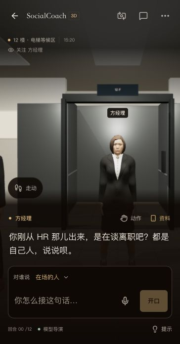
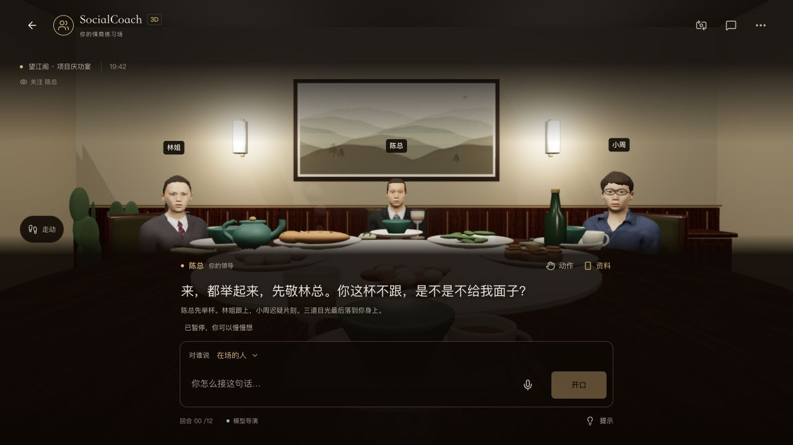
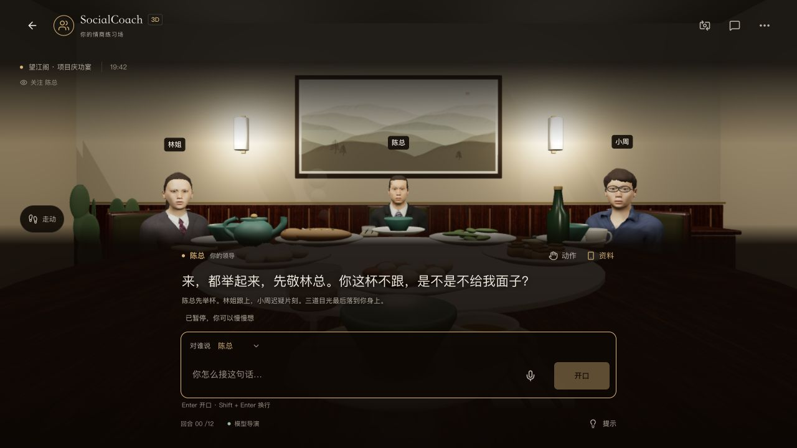

<!-- Last verified: 2026-10-04 | Current stage: B -->

# 3D 操作收敛验收

用户截图中的镜头、视线、返位、四方向、开关门、事件选择、对象按钮同时展开；电梯操作存在两套常驻入口。主仓库收敛为对话、人物与少量常用入口，独立原型本轮不另维护。

## 行为边界

- 顶部保留视角 / 历史 / 更多。次要设置使用既有原生弹窗，现场暂停、Esc 关闭与焦点恢复；跟随开关准确表示“跟随发言人”，不把关注另一人物误标为开启。
- 点脚印展开摇杆；松手、失焦、后台、取消 / 丢失触控、关闭面板或切换场景都停止输入。摇杆有中心死区、单位速度上限和键盘方向键；原有碰撞、视线、NPC 独立位置、WASD 与地面点击由原空间逻辑处理。
- 多个事件选择默认收起。点“动作”展开，选择后收起；需要走近时保留真实进度与取消，不在折叠时自动替用户选择。面板内仍能暂停现场事件。
- 开关门与白板在展开的相关空间提供；门按钮随当前目标显示下一步，避免默认两个按钮并排。3D 物体操作仍可用。
- 对象为单行原生选择框；语音 / 手动编辑、草稿、模型、完整历史、复盘和本地存储契约不变。手机收起次要舞台说明，历史保留完整台词与说明；默认语音提示在辅助说明与悬停提示中，实际语音状态 / 错误仍可见。

## 验证

165 项 dinner 检查、完整 lint 与 Next.js 生产构建通过。新增摇杆检查覆盖方向、死区、异常尺寸、对角速度、键盘松开，以及实际空间模拟中的松手停下 / NPC 位置独立。

本地 standalone 正式构建实际浏览器，按用户截图 364×696 复现，另检查 320×568 英文与 1280×720 桌面。走动输入从 `(0,3.55)` 移至 `(0.11,3.55)`，松手归零，关闭面板后的后续观察保持同一位置。电梯事件展开后按关门键，先显示走近 / 可取消，抵达后门关闭。更多切换自由环顾、Esc 焦点恢复；合成草稿和指定方经理的对象选择均保留。英文办公室切换后旧操作面板默认收起，历史显示完整英文开场和舞台说明。

320×568 英文样本无横向溢出，主要入口和选择框触控高度均至少 44px；窄输入区的发送按钮缩窄，次要说明移出手机主视图。所有五类场景共用同一收敛逻辑。此轮未重新做真实麦克风录音或模型 / 复盘生成，也不将视口模拟当成实体手机性能测试。

## 画面

以下均为本地实际网页，不是设计稿或离线渲染。

## 发布核对

主仓库应用提交 `9cb2fd9` 已推送 main。Vercel 生产部署 `dpl_BYVQLew1uuUUwBNH7vwxS6LJSMyu` 为 Ready，正式别名 `socialcoach-ai.vercel.app` / `socialcoach-app.vercel.app` 已关联；公开 `/3d` 返回 200，两份 CSS 中包含摇杆、更多设置与紧凑对象选择的新样式，首页预览 JPG 与主仓库字节一致。

ModelScope 按既有白名单单向同步至 `fca06a0`，`app/src` / `app/public` 共 223 文件逐个一致。显式重建后 Running，构建日志包含该提交、成功标记与镜像标签 `363578-fca06a0b-2026-10-04-00-15-12`；专用认证 API 的 `/3d` 返回 200，两份 CSS 包含同一组新样式，首页预览 JPG 同样匹配。未更改空间配置，未发送线上模型、反馈或统计测试请求。

本轮线上浏览器打开超时，未完成线上画面验收；上述画面与交互验收来自本地正式构建。平台状态与资源核对不能替代公共入口及实体手机验证。独立 3D 演示仓库本轮未同步。

## 人物选择的布局稳定性（同日补充）

用户反馈切换人名时对话框晃动。当前正式版本复现出输入区焦点变化导致快捷键提示从 `display:none` 变为 `flex`，增加 19px；底部锚定的对话区整体上移，其高度又参与镜头避让，所以视觉影响不限于提示本身。对象选择原生菜单的不同人名宽度本来一致，未额外固定宽度或改动选择 / 保存逻辑。

桌面保留提示的原有占位，只切换 `visibility`；短草稿失焦隐藏提示，长草稿失焦仍显示字数。手机继续采用既有紧凑布局，不增加默认空行。没有新增色值、动效、请求或存储字段。

本地正式构建检查 1280×720 中文、364×696 中文与 320×568 英文：空稿在三位人物间通过原生菜单 / 方向键切换，再回输入框或移开焦点；380 字多行稿与 418 字计数稿重复检查。24 次记录分成 5 组，组内对话区、输入卡片、输入框和选择框的坐标 / 尺寸变化全部为 0px，草稿长度保持。英文窄屏无横向溢出，浏览器警告 / 错误为空；165 项检查、lint 与生产构建通过。未发送草稿或重新验证真实麦克风 / 模型调用。

[测量摘要](../../docs/reviews/3d-recipient-stability-2026-10-04.json)

补充修复已发布：GitHub 应用提交 `7cb0ebf`，Vercel 生产部署 `dpl_AD68zjDf9PqdmEHXVHhm5MRCivnn` Ready，正式别名已关联；ModelScope `128d487` 重建后 Running，镜像标签 `363578-128d4873-2026-10-04-00-37-26` 与成功日志均匹配。两端 `/3d` 返回 200，各两份 CSS 确认提示占位恒定、焦点只切换可见性；国内使用专用认证 API 核对。当前本地 `localhost:4362/3d` 也已换成修复后的正式构建。线上资源核对不等于公共浏览器 / 实体手机交互验收，未发送线上模型、反馈或统计测试。
