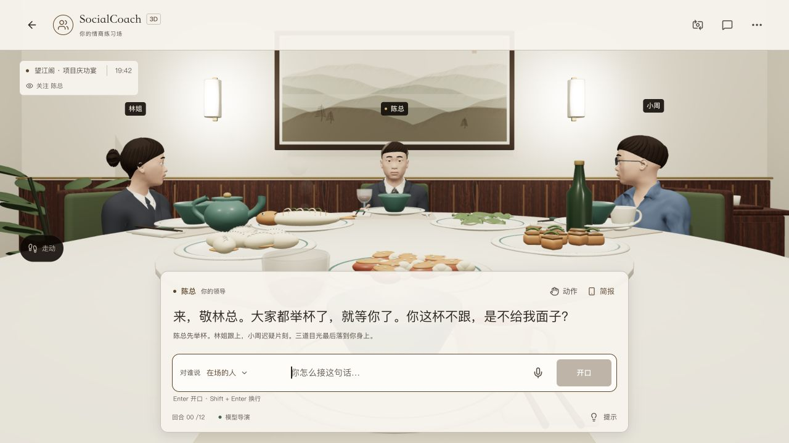
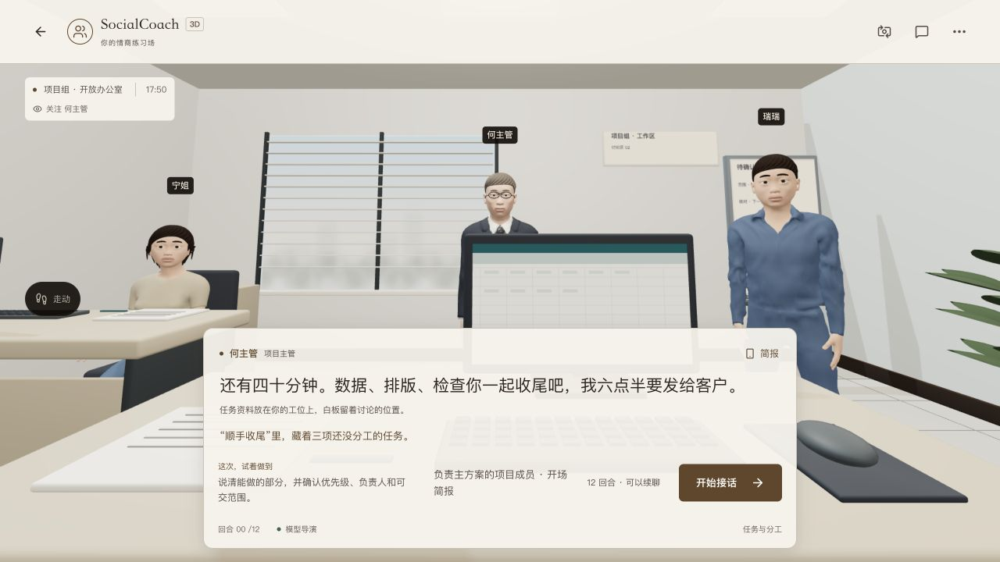

<!-- Last verified: 2026-10-05 | Current stage: B -->

# 成人动画 3D 本地验收

主站 `/3d` 已换成一致的成人动画美术，本轮尚未发布。16 位人物、两份第一人称手臂、五个房间与杯具共 24 GLB；主仓库维护可复现 Blender 制作脚本，编辑源在本地 `.blender-work/generated/`。独立演示仓库未同步。

实际角色比 A 概念图更简化；概念图仅是方向参考，以下检查与截图都来自运行中的模型。年龄 / 身份辨识和真实手机体验仍需用户验证，不据此宣称已经消除恐怖谷或达到动画电影品质。

## 改动与试玩发现

- 头颈、附件、全部形态键与 rest 骨骼同步调整比例，眼高重新导出；身体权重、原坐标与存档保持兼容。
- 哑光皮肤顶点色、曲面上的虹膜 / 瞳孔、实体眉毛、短发 / 齐耳发 / 后盘发和灰发；去除照片皮肤与透明发片。
- 六个中性面部控制组合现有五类情绪，口腔和眉毛随对应控制，说话时减轻唇压。外观不会影响 NPC 立场或评价证据。
- 房间采用一致的色板 / 低频木纹。电梯全身试玩发现不合适的短裤、裤腿与袜筒穿插，已改长裤并裁去裤内高袜筒。年长角色减少头宽夸张并保留明显灰发。
- 近景修复眼睛 / 牙齿与旧 Basis 分离、头发顶部半径跳变、盘发埋入后脑。根因与检查见[资产复盘](../81-postmortem-animation-assets.md)。

## 检查结果

| 检查 | 结果 / 实际范围 |
|---|---|
| 3D 检查 | 228 项通过；包含全员统一美术、六控制、中性权重、12 姿态、完整资产与旧存档 / 交互回归 |
| 格式 | 24 GLB，Khronos validator 0 errors / 0 warnings；Draco unsupported 是 informational，另在浏览器解码 |
| 眼 / 皮肤 | 16 人：中性虹膜可见、闭眼遮挡、原始 mesh 与 Basis 对齐 |
| 脚底接触 | 16 人 × 站 / 坐，32 组双脚的实际变形鞋底检查通过 |
| 重建入口 | 从外部 MPFB / CC0 素材完整重建陈总通过，眼高与快速迭代结果一致；其余办公长裤人物也使用完整重建入口 |
| 代码 / 构建 | lint 无警告，Next 16.3.4 默认生产构建与 TypeScript 通过，22 路由；测试夹具未加入主站 |
| 桌面正式构建 | 职场、家庭、校园、电梯、办公室均加载对应三人 / 房间；观察近景 / 侧面 / 全身；第一 / 第三视角、独立走动、回到座位、茶杯与历史可用 |
| 实际模型 | 职场以茶拒酒并追问验收：陈总接话，小周插话；原话 / 对象 / 动作均进入完整历史，人物口型、转头与情绪继续显示 |
| 手机尺寸 | 实际页面 390×844，长草稿可编辑、手工选择对象、人物位于对话区上方、第三视角可用；测试草稿清理，视口恢复 |
| 日志 | 正式构建浏览器未捕获 error / warn |

没有在本轮重新跑完整的文字复盘模型盲测；评估、剧情事实和 API 未变。第一人称握杯仍使用已有手腕偏移，不宣称实现手指接触求解。

## 资源与性能边界

| 资源范围 | 调整前 | 动画版 |
|---|---:|---:|
| 全部 24 资源 | 51.03 MiB | 约 29.6 MiB |
| 职场首场：房间 / 三人 / 杯具 / 两份手臂 | 10.27 MiB | 约 5.87 MiB |

这是清单字节数，包含按需手臂；预取的玩家另约 1.6 MiB。房间按当前空间加载，仍不预取全部人物。

本机暖场一次采样：120 FPS、P95 9.2ms、DPR 1.5、94 draws、约 34.6 万三角形。这是桌面特定状态的短样本；新的实体发型与眼球增加几何，贴图和透明叠加减少。不能据此宣称手机更快，也不是严格的前后性能基准。

仍待验证：真实手机冷加载 / 发热 / 中低端 GPU、真实设备倾斜、用户盲测年龄与身份、五类情绪和压力感、是否愿意继续 / 重玩。已有目标写入 [backlog](../85-backlog.md)。

## 实际画面

