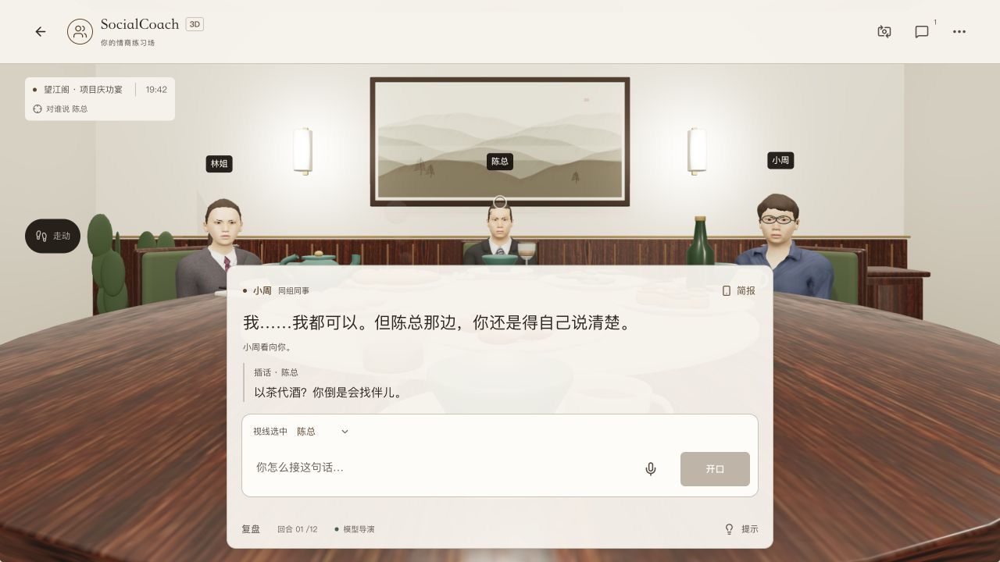
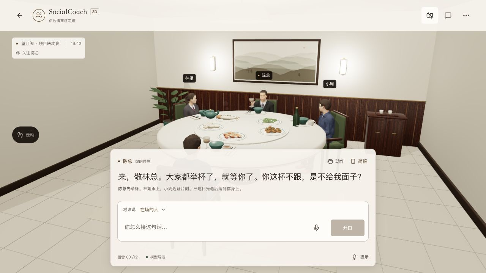
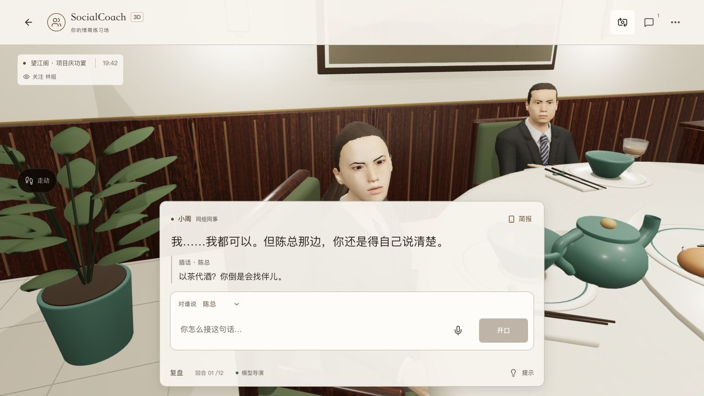
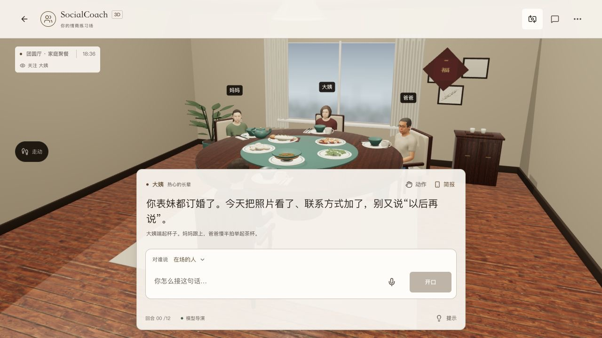
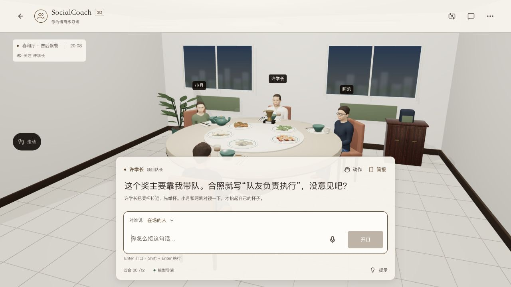
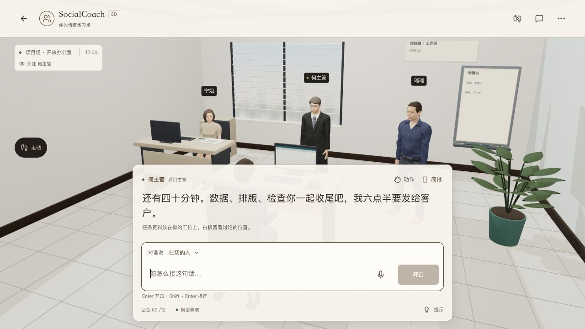
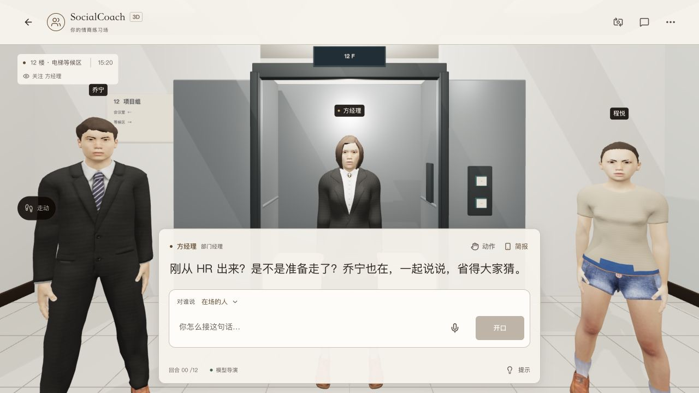

<!-- Last verified: 2026-10-05 | Current stage: B -->

# 3D 近景材质与陈设细化

基线 `144c97c`，主仓库本地实现，尚未发布，独立演示仓库未同步。用户提出画面粗糙会影响第一印象；本轮检查实际 `/3d`，再修改离线资产与现有灯光。

## 判断与改动

粗糙感成立：大面积木纹与凹凸抢过人物，菜品重复为椭球 / 方块，盘沿厚、植物为简单椭球，皮肤与服装照片在近景缺少细节。明亮场景的多路补光又容易让材质显平。本轮保持明亮室内，将改动集中到近处的材质与形状。

- 皮肤照片 1024 → 2048、衣料 512 → 1024；不透明照片采用 JPEG 80，透明发片与眉毛保留 alpha。烘焙 128px 微法线，布料与皮肤使用不同采样；保留原形态、骨骼、眼高与动作。
- 三角化保留形态键 / UV / 权重层，导出切线、表情法线。第一人称手臂从同一玩家源重新导出。格式检查发现的无 UV 与切线问题已修复，未压下警告。
- 薄瓷边、釉色环、饺子捏褶、鱼尾与配菜、叶菜折面、番茄切面、肉块与面条；家庭 / 校园 / 职场采用不同菜品组合。职场桌面铺合尺寸的亚麻布，胡桃木法线减弱，植物改成有折面的尖叶。
- 家庭 / 职场地毯与地板同属 `Floor`，避免装饰挡住点击行走；侧柜补茶盘与备用杯。主光、补光与环境反射重新配比，曝光 1.12 → 1.02。没有新增全屏特效或每帧纹理生成。

## 验证

- 222 项现有 3D 检查通过；代码检查、类型检查和正式构建通过。导出 24 GLB 全部为 0 errors / 0 warnings；32 组站 / 坐鞋底检查通过。
- 正式 `/3d` 冷加载、两种视角、走近林姐、原有举杯动作实际操作；职场 / 家庭 / 校园 / 办公室 / 电梯五个空间逐一加载检查，控制台无警告或错误。新增内容均为真实浏览器渲染，没有使用离线肖像充当页面验收。
- 本机正式职场暖态采样约 120 FPS、P95 8.9 ms、105 绘制 / 66 纹理。该记录只代表本机，不能推定低性能手机或冷加载提升。
- 模型、BYOK、语音、剧情和存储接口没有调整。本轮没有追加模型对话或真实麦克风采集。

## 画面证据

旧版观察图和新版机位 / 对话状态不同，用于记录问题与结果，不作为同机位像素比较。

## 体积与边界

全批次 41.40 → 50.98 MiB；职场房间、三名 NPC、两份手臂与杯具之和 8.09 → 10.26 MiB。仍只加载当前空间，单个人物最大约 2.98 MiB。新增清晰度有冷加载成本，不能宣传为“质量升级且零成本”；不预加载全演员、不加入全场后处理。

人物仍为实时游戏素材，表情细腻度、头发与真实照片存在差距。本轮降低部分粗糙感，不宣称照片级真实。

- [ ] 低性能真实手机的首次等待、帧率、发热与长时运行。
- [ ] 本轮手机布局复验：浏览器尺寸覆盖未生效，实际仍为 1280 × 720，不能把这次截图计为手机验收。地板名称与命中关系已通过资产检查，新增地毯区域的实际点击行走仍需复验。

制作与复现见[Blender 管线](../../app/scripts/blender/README.md)。机制依据：[Three.js 材质](https://threejs.org/docs/pages/MeshStandardMaterial.html)、[Blender glTF 导出](https://docs.blender.org/manual/en/5.0/addons/io_scene_gltf2.html)；微法线为非颜色数据，照片保留其来源，色板仍只在 CSS。
