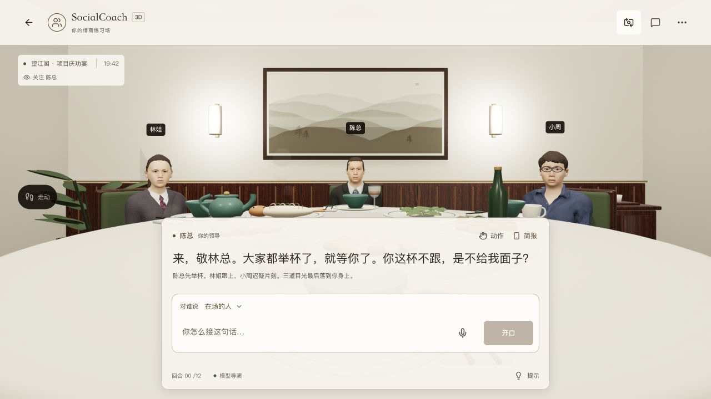
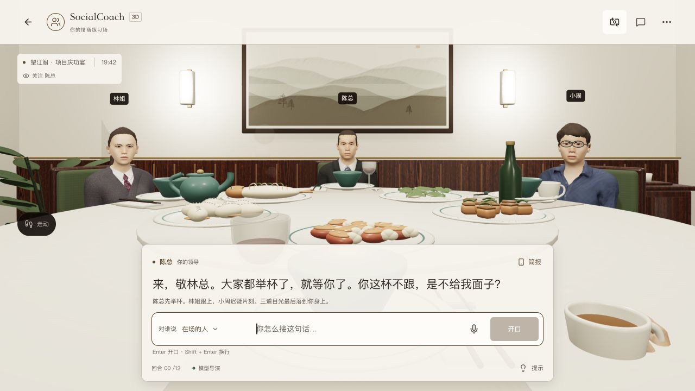
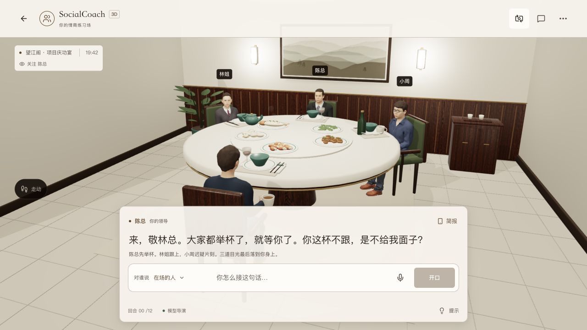
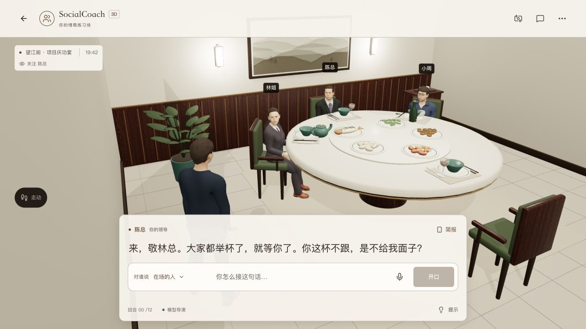
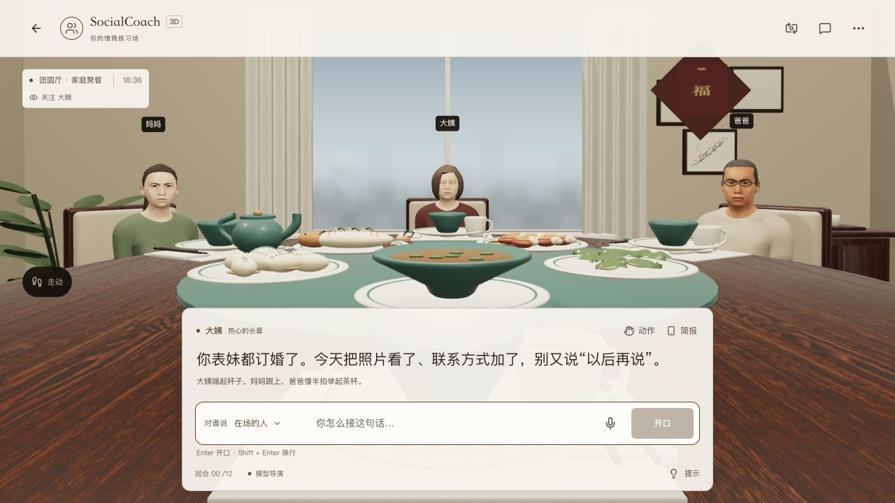
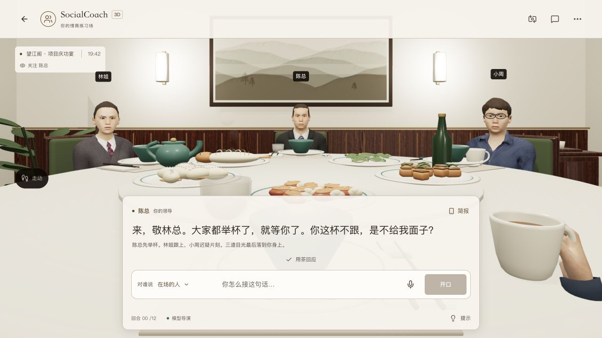
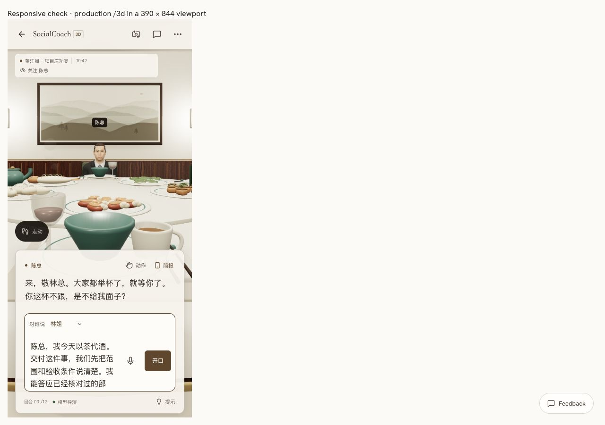

<!-- Last verified: 2026-10-05 | Current stage: B -->

# 3D 构图、近景比例与握杯细化

接续 `16d5361` 的材质细化；用户仍认为画面粗糙。本轮只在主站修改，尚未发布。

## 观察与结果

上一轮增加纹理，仍没有解决第一人称人物偏远、桌面空白过大、字幕覆盖前景和小屏近物夸张的问题。本轮实际检查了桌面、390 × 844 页面和长草稿，按可见问题改动：

- 桌面饭局第一人称视野 55° → 48°；竖屏坐姿上限 96° → 75°，站姿上限 80°。手机默认关注正在对话的人，左右环顾能看到同桌人物。玩家位置、人物位置与存档尺度未改。
- `dialogueFraming()` 按导航和对话栏的可见区域计算投影偏移。注视的实际方向保持原值；视线选人的标记和投影共用偏移。长输入和入席前也保持脸部可见。
- 桌面对话对象与输入框合为一行。1280 × 720 的中文首局面板由约 310px 降至 262px；四种对象的输入区矩形相同。手机保留两行结构和 44px 控件，长草稿可滚动编辑，历史仍完整显示原话。
- 纹理按硬件能力启用最多 8 倍各向异性过滤，保留共用照片与纹理缓存；不增加照片分辨率或外部请求。房间可用后异步预取唯一的玩家模型，减少首次切换第三人称的等待；节省流量模式跳过。玩家约 2.7 MiB 的后台传输不计入首次场景就绪，但有带宽与内存成本。
- 将已经计算的呼吸节奏接入脊椎，表情中的微笑平滑过渡。没有额外人物位移；暂停、隐藏页面和减少动效仍停止相应活动，也没有改变 NPC 的立场。
- 三桌补个人餐垫和有内凹的瓷勺，对齐餐垫、盘、碗、杯子的接触高度。根据原玩家握手姿态核对拇指与食指位置，调整杯柄 / 杯茎与手的相对位置，缩小杯底。近景手臂拉远，所有宽高比检查手与杯子的右边界，避免被画面边缘裁掉。酒液采用现有酒红色，茶保持原色。复核家庭低机位后，修正汤面高度与液体轮廓；所有旋转曲面修正外向面顺序并在制作时检查法线，详见[餐具复盘](../81-postmortem-table-surfaces.md)。

## 验证

- 227 项现有与新增 3D 检查通过；两项新增投影检查覆盖桌面全桌脸部，以及五空间在桌面、手机、长草稿和短横屏中的发言人位置；新增多材质地板与控件的祖先标识检查，以及杯具各部分原点检查，防止网格坐标与节点变换混用造成悬空酒液。
- 代码检查无警告；字幕墨色在半透明纸面上的最小对比度约 5.09:1。类型检查与正式构建通过，临时响应式检查页没有进入主仓库或正式构建。
- 24 个 GLB 格式检查 0 errors / 0 warnings，最后修正餐勺高度后重跑资产完整性检查。人物源、骨架与脚底几何未重新生成。多材质地板拆成子网格后，点击和投影阴影使用祖先的表面标识；地板接缝也能行走。
- 正式页面操作了中英文、四种对话对象、历史与用茶回应；五个空间逐一回放。空闲预取后首次切第三人称没有整幕加载画面；实际点击地面、走到房间一侧、回到座位通过。页面出现新草稿后保留原标签页，最后验证改用独立预览。390 × 844 检查包含原页面 iframe、实际小屏预览、长草稿编辑和环顾看到小周；它们不能代替真实手机性能或传感器验证。

最终正式职场页面采样约 107 FPS、P95 14.5ms、107 绘制、DPR 1.5；已切过第三人称，原用户预览也仍在运行。此样本不适合与此前独立暖态采样直接比较，更不能推定真实低端手机性能。最终标签页控制台没有警告或错误。

## 实际页面证据

同一桌面机位的首局画面；呼吸、眼睛与杯子的瞬时姿态并非逐帧同步。

## 边界

新增餐桌细节只重新导出三间饭厅和杯具。全批次增加约 51 KiB，当前空间按需加载不变；各向异性过滤会增加纹理采样成本，不能把本机流畅推定为低端手机也流畅。

脸型、头发和手指仍是现有游戏资产，本轮没有把人物重新做成照片级角色，也没有完整的手部 IK / 接触物理。握持仍需在更丰富的姿态和真实设备上继续核对。

- [ ] 真实低性能手机的长时运行、发热与倾斜操作；不同动作下的手指接触细节。
