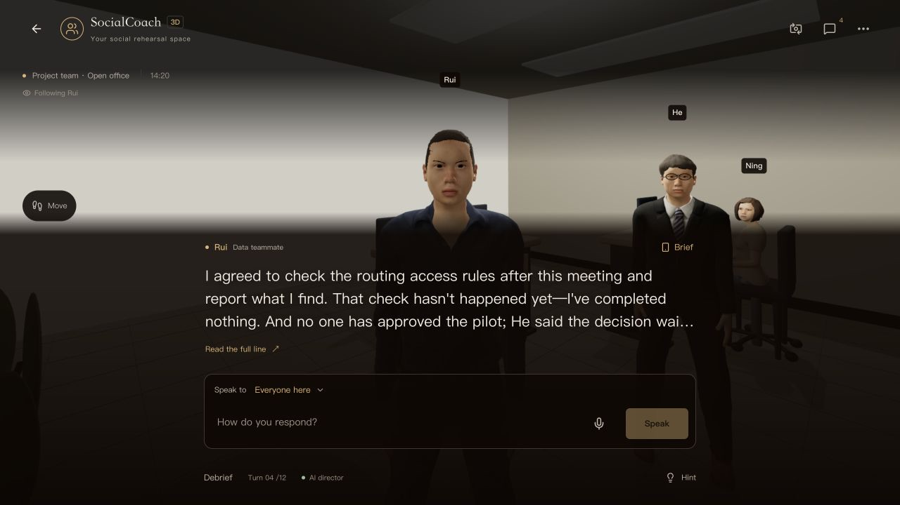
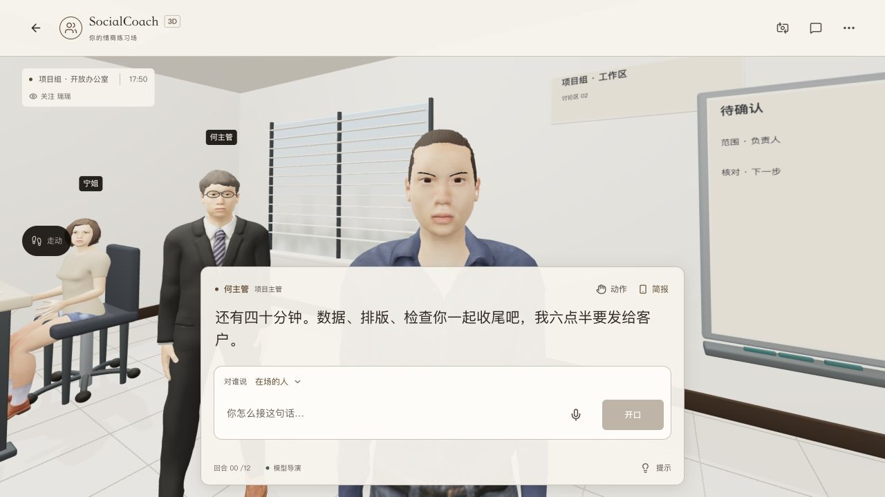
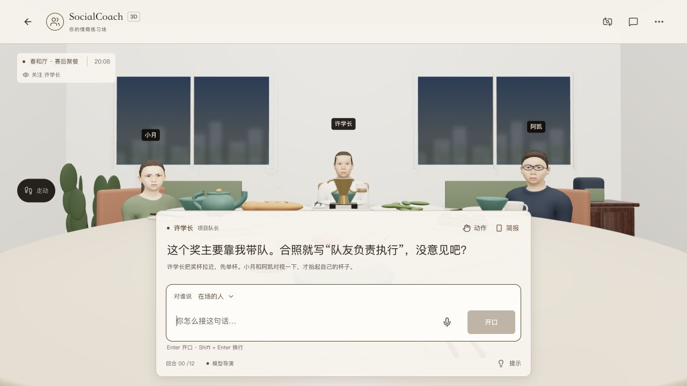

# 3D 光照与明亮室内验收

日期：2026-10-05（本地），基线 `2fe3c6f`。主仓库实现；未推送 / 未发布，未同步独立演示仓库。

## 问题核验

“阴暗、发灰、不像正常有人使用的空间”成立。实际办公室的全屏 scrim 在顶部使用 82% 黑底，底部还按整个 HUD 高度叠加 88% 黑底，墙面尚可见，人物衣服和地面成为黑影。金属没有环境反射，窗户为单色面，部分灯具显示为灰色实心板。场景的剧情时间也未影响窗外。

修改前的实际办公室：

## 已实现

1. 移除全屏 scrim，将可读性放到实际文字面板中。局部浅色暖纸字幕 / 输入、顶部工具条和场景定位；原有弹窗单独处理背景。
2. 提亮墙面、地面、布艺与肤色，餐厅暖光、电梯中性光与轿厢补光、办公室窗光分开。接触阴影降低，保留几何与衣服的层次。
3. `RoomLighting` 一次性生成 128px PMREM 本地反射探针，金属 / 瓷器具有宽光源反射。切换卸载释放目标、几何和材质；不捕获每帧，不下载 HDRI。
4. 发光材质沿 CSS 色板更新。窗外柔焦楼宇 / 树影与办公屏幕无数字工作网格均为本地生成纹理，保留窗框、百叶和显示器边框。没有增加剧情事实或模型请求。
5. 按剧情时钟区分日间 / 暮色 / 晚间。校园 20:08 为晚间窗景，室内依然明亮；家庭 18:36 为暮色。餐厅 19:42 由室内暖灯照明；办公室 14:20 / 17:50 为日间。
6. 首页、欢迎公告和中英 README 使用新的实景预览文件名，避免继续命中旧截图的图片缓存。该小修订不增加 News 条目。

## 实际画面

| 空间 / 状态 | 证据 |
|---|---|
| 餐厅第一人称，正式构建 | [实景](../../docs/screenshots/3d-lighting-work-production-after.jpg) |
| 餐厅第三人称，正式构建 | [实景](../../docs/screenshots/3d-lighting-work-third-after.jpg) |
| 家庭 18:36 暮色 | [实景](../../docs/screenshots/3d-lighting-family-after.jpg) |
| 校园 20:08 晚间 | [实景](../../docs/screenshots/3d-lighting-school-after.jpg) |
| 电梯与轿厢 | [实景](../../docs/screenshots/3d-lighting-elevator-after.jpg) |
| 办公室走近瑞瑞 | [实景](../../docs/screenshots/3d-lighting-office-after.jpg) |
| 办公室 390×844 | [视口检查](../../docs/screenshots/3d-lighting-office-mobile-after.jpg) |
| 餐厅 390×844，正式构建 | [视口检查](../../docs/screenshots/3d-lighting-work-mobile-production-after.jpg) |

修改后的办公室。前后机位不同，用于验证全场可见性，不作为同机位像素比较：

晚间窗景和明亮室内并存：

## 检查与边界

- `pnpm test:dinner`：215 项通过。
- lint、类型检查及隔离正式构建通过。正式版 /3d 首次加载、刷新、第一 / 第三视角、开局和手机视口已实际操作；正式版冷加载后的浏览器警告 / 错误日志为空。
- 五空间的开发预览实际切换、中文 / 英文、对象选择、走近人物与字幕位置检查完成。手机视口还原到正常尺寸后交付。
- 本机暖态采样：正式餐厅约 128 FPS、P95 9.4 ms、95 绘制 / 58 纹理；办公室约 123 FPS、P95 10.0 ms、56 绘制 / 59 纹理；电梯约 125 FPS、P95 9.6 ms、47 绘制 / 54 纹理。设备 / 浏览器条件不同不能横向承诺提速；这些不是低性能真机结果。
- 保留照片材质本色、已有模型 / 骨骼、导航坐标、存档、模型 / BYOK 与共用复盘。角色目前仍是风格化素材，表情、服装拟合与装饰密度不能凭灯光改动宣称达到照片级真实。
- 开发热更新中新增 CSS 色板与改变 effect 依赖长度曾引发旧实例的临时错误；完整刷新后恢复，最终正式构建另行冷加载验收。截取旧实例错误状态不计为验收通过。

设计规则见 [3D 明亮室内](../03-design-principle.md#3d-明亮室内与场景时间2026-10-05本地验证)，渲染所有权见 [系统架构](../02-system-architecture.md#blender-资产与真实骨骼接入2026-10-03)。
