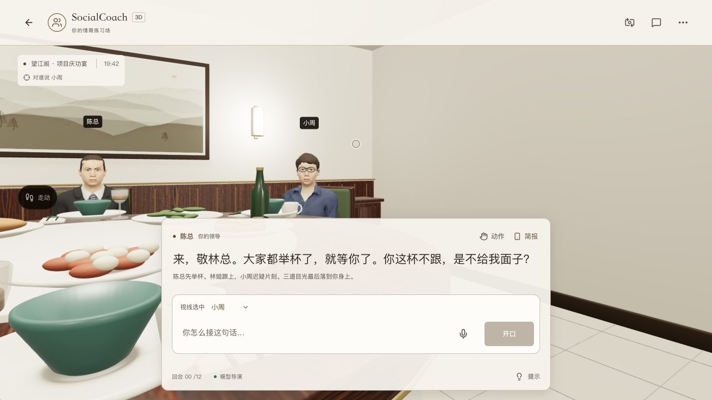
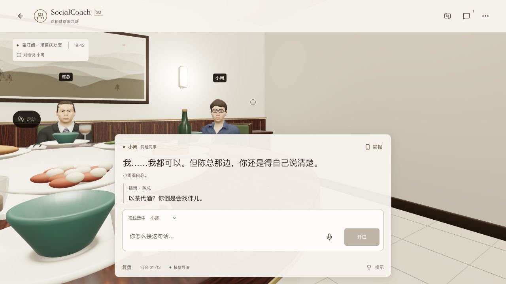
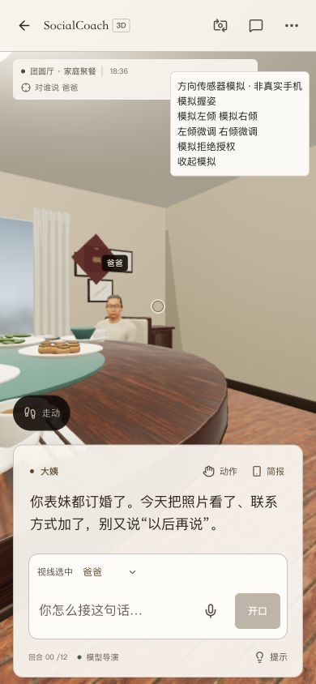
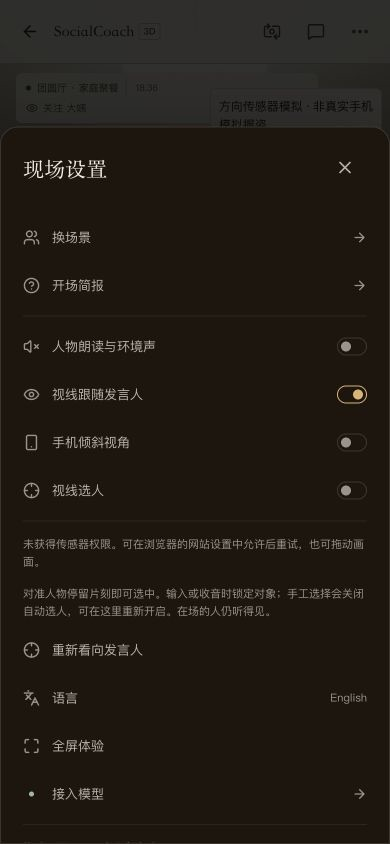

# 手机倾斜视线与选人验收

日期：2026-10-05。基线 `f27a089`；主仓库本地实现，尚未推送 / 发布，未同步独立演示仓库。

## 实现与判断

「左右倾斜手机环顾，再看向某个人说话」适合当前固定 NPC 的空间。将传感器输入作为临时视线偏移，避免把 NPC / 玩家一起带走、把传感器数据存进档案，或让跟随发言人与倾斜控制持续争夺同一个角度。

- `TiltSession`：用户点击才请求权限，首次有效重力方向校准握姿；横竖屏、竖直握持、无数据、权限拒绝、迟到授权、关闭 / 卸载、输入 / 后台暂停和回正。
- `CameraRig`：±36° 有界左右环顾、1.5° 握持死区、平滑叠加；两种视角均只改变视线，第三人称玩家头部读取同一偏移。NPC 坐标、玩家路径和导航方向保持独立。
- `GazeRecipient`：真实投影中心含 HUD 偏移，镜头稳定 0.7 秒后选人。屏外、重叠、快速掠过、人物移动及场景 / 其他人物遮挡不产生新选择；射线只在满足停留后检查，不每帧扫描。
- 保留原有下拉框，当前对象与定位说明一致。手工选择关闭自动选人，草稿 / 收音 / 请求时冻结目标；重新开启需要明确操作。语音沿用可编辑草稿与确认发送。
- 顶部工具条没有增加按钮。开关集中于更多，拒绝 / 缺少有效读数有明确退路；方向数据只在当前页面内使用。

## 验证记录

- lint、类型检查和隔离正式构建通过；正式输出 22 个页面，不含测试页。
- `pnpm test:dinner`：222 / 222 通过，其中新增 7 项方向、权限、生命周期、两种镜头与稳定选人测试。两种相机返回同一位置、不同视线目标，房间快照保持不变。
- 隔离开发预览的测试页通过**页面按钮发出受控 deviceorientation 读数**，显著标记「方向传感器模拟 · 非真实手机」。测试页与权限替身只存在临时副本，不在主仓库 / 正式构建中。
- 受控数据实际验证：中间大姨、右侧爸爸、左侧妈妈的切换；第一 / 第三人称；手工爸爸优先；输入草稿时大姨保持；模拟拒绝权限后两个开关均未自动开启；允许后可重试。
- 390×844 视口检查：设置开关 / 权限提示、第一 / 第三人称与右侧人物选择。首版目标范围过窄，手机上轻微偏离中心难选；适当放宽后仍保持重叠保护与停留确认。视口已恢复正常尺寸。
- 正式 `/3d` 冷加载：单独开启视线选人，键盘环顾右侧后自动选中小周；输入「小周，我今晚想以茶代酒，你愿意一起吗？」后对象保持，模型返回小周主回应与陈总插话，回合到 01。没有使用模型替身，也没有采集真实麦克风音频。
- 加入其他人物遮挡检查后的最终构建重新冷加载，先手工改为陈总，再开启视线选人；稳定环顾右侧后切回小周。最终正式页浏览器警告 / 错误日志为空。共用提交、语音、模型与复盘接口未改动。

正式构建选中右侧人物：

选中对象进入实际回复链路：

手机视口使用受控方向读数，不是实物传感器验收：

## 待验与范围

- [ ] iPhone Safari、Android Chrome、微信浏览器的真实授权提示、倾斜手感、屏幕旋转、后台恢复、减少动态效果与性能。
- [ ] 真机语音收音同时倾斜时的目标锁定与编辑交接；本轮没有真实音频采集。

不能将桌面视口、受控事件或既有语音测试宣传为真机体验已经通过。主仓库方案见 [手机倾斜与选人](../specs/spec-3d-tilt-look.md)，接口机制见 [方向事件参考](../refs/browser-device-orientation.md)。
