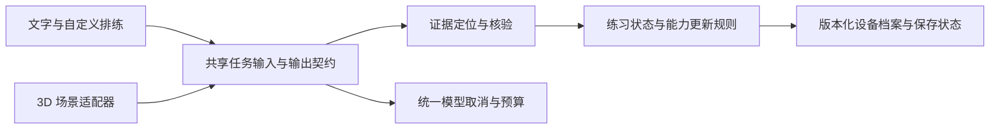

<!-- Last verified: 2026-10-05 | Current stage: B -->

# SocialCoach 全仓架构、算法与功能评审

## 结论与范围

**结论：需要修改（Needs changes）。现有架构适合继续迭代，但核心反馈与档案链路还有可信度缺口。** 这轮确认了 6 项 P1 问题／风险和 7 项 P2 问题／风险；没有确认 P0。应先解决证据、存储、输出契约和能力估计，再扩大功能与流量。

评审基线是主仓库 `d55a2b2`，日期为 2026-10-05。开始时唯一工作区差异为未跟踪的 `docs/research/`；本轮没有改应用实现、没有提交或部署，没有访问用户实际练习档案。评审结果对应当前本地源码，不代表线上部署已经包含这些源码。

深读范围：产品提案、路线图、架构、设计约束、API、已知坑与 backlog；文字练习的排程、角色适配、对话、提示、点评、反思、跨场次模式；服务端／BYOK 模型适配与取消；主 store、导出、恢复；3D 的导演、状态校验、存档、动作证据与共用复盘；语料检索／来源结构、匿名统计、构建、Docker 与 CI。仓库有 194 个应用源文件和 90 个测试／脚本文件，按关键数据流检查，未逐行审阅全部视觉组件。

未覆盖：当前线上模型的付费回放、真实手机 GPU／传感器／语音表现、真实用户学习迁移、平台上的限额与监控配置、全部第三方依赖安全公告、每条书籍引用的原文真实性、独立 3D 原型仓库。资产生产与材料出处只检查入口和边界，未重新运行完整 Blender 批次。**合成模型输出用于证明校验边界可以被突破，不能据此估计真实模型的发生率。**

## 优先级总表

| ID | 优先级 | 类型 | 问题 | 证据强度 |
|---|---|---|---|---|
| R1 | P1 | 已复现缺陷 | 跨场次模式接受伪造引文、错绑场次，也漏掉同场景重练 | 合成任务复现 |
| R2 | P1 | 已复现缺陷 | 主档案写入失败与合法 JSON 的坏结构没有可靠恢复 | 存储故障注入 |
| R3 | P1 | 已复现缺陷 | 自定义场景／适配缺少完整运行时契约 | 合成任务复现＋源码 |
| R4 | P1 | 算法设计问题 | 熟练度是非负累计奖励，不能区分稳定能力与练习次数 | 算术复现＋源码 |
| R5 | P1 | 产品约束缺陷 | 反思反馈绕过引文／来源校验；重试会错配问答 | 合成任务＋实际网页复现 |
| R6 | P1 | 运行风险 | 公开模型额度没有跨实例、按成本计算的硬边界 | 源码；平台配置未核实 |
| R7 | P2 | 生命周期缺陷 | 取消与总时限没有贯穿模型请求 | 源码 |
| R8 | P2 | 算法设计问题 | 排程没有消费复盘诊断与反思证据 | 数据契约／源码 |
| R9 | P2 | 检索设计问题 | 知识检索的中文、时序和诊断相关性薄弱 | 源码；质量需盲测 |
| R10 | P2 | 已复现契约缺陷 | 底牌／目标元数据可以与可见台词矛盾 | 合成输出复现 |
| R11 | P2 | 兼容性风险 | 3D 旧局在复盘时重新读取当前场景定义 | 源码；跨发布迁移未实测 |
| R12 | P2 | 交付风险 | 应用测试没有进入仓库 CI 的持续门槛 | 工作流与包脚本 |
| R13 | P2 | 产品验证缺口 | 3D 核心漏斗和模型修复成本缺少可观测性 | 调用点与事件契约 |

## R1｜跨场次模式的证据与身份校验失效

位置：[pattern.ts](../../app/src/lib/tasks/pattern.ts) 第 63–75 行、[PatternCard.tsx](../../app/src/components/PatternCard.tsx) 第 20–41 行、[PatternSession](../../app/src/lib/tasks/types.ts)。

有三个相互独立的问题：

1. 校验接受 `v.includes(q) || q.includes(v)`。后一个方向允许“真实原话＋模型编造的后半句”作为引文通过。
2. 指定标题下找不到时，会在所有场次的引文中兜底查找；之后只按模型返回的不同标题计数。因此，同一场的同一句话挂到 A、B 两个标题下也能满足“跨两个场次”。标题甚至无需属于输入。
3. 输入没有 `sessionId`，用场景标题代替场次身份；两次重练同一场景的标题相同，会被 Map 覆盖，且无法满足不同标题数量。

实际复现：同一引文错挂两个标题，`found:true`；给引文追加“所以我同意无条件加班。”，仍 `found:true`；两场真实同标题练习，`found:false`。现有 `check-pattern-guard` 的 5 项检查仍全部通过，说明它没有覆盖这些反例。

影响：这是产品定义的 A→B 转化引擎。它可能把一次行为包装成习惯，也无法识别用户最自然的同场景重复练习。

建议：输入／输出使用稳定 `sessionId` 和原话位置；只在指定场次的真实原话内查找，返回原转录的字面片段；若容忍标点差异，先定位再还原原话。跨场次计数基于已验证的 ID。对连续 3D 快照另用 `practiceId` 区分独立练习，不能把同一局的重叠转录视为两次行为。

验收：编造后缀、错误标题／ID、同场借用、重复证据全部拒绝；同标题不同场次可以成立；同一 3D 局的重叠快照不算独立复现。

## R2｜本地持久化只解决了部分读取失败

位置：[useApp.ts](../../app/src/store/useApp.ts) 第 121–128、217–245 行；[AppProviders.tsx](../../app/src/components/AppProviders.tsx) 第 20–28 行。

现有恢复机制正确保护了非法 JSON 与首次访问拒绝，但存在两条已复现的失败路径：

- 写入 `QuotaExceededError`：Zustand 的内存状态先变更，再保存失败并抛错。复现中，新发言已经存在于内存，磁盘仍是旧记录，`storageIssue:null`。用户刷新会失去这条记录，界面没有统一的“尚未保存”状态。
- 合法 JSON 的坏结构：`{"state":{"profile":null,"sessions":null},"version":0}` 可以进入合并路径。`partialize` 随后调用 `sessions.slice()` 抛错，错误恢复微任务再次持久化同一个坏结构又抛错；普通页面也假设 `sessions.some()` 可调用。

此外，主存储没有跨标签页冲突机制。两个标签页各持有一份旧内存，保存时覆盖整个 blob，是覆盖新记录的风险；本轮没有单独进行双标签页实测。只截取 200 个 session 也不是字节预算，长转录／自定义场景／头像仍可能达到配额。

建议：在 hydrate 合并前验证版本化档案；坏结构留原始字节并进入可操作恢复页。写入失败必须显式标为未保存，保留可导出的内存记录；成功重试后才消除提示。按记录大小制定保留策略，选择适合分记录持久化的设备存储。使用档案 revision／跨标签页通知检测冲突，并把现有单场报告防重扩展到该场景。不要为此引入账号或服务端练习存储。

验收：合法坏结构、保存时权限变化、配额耗尽、失败后导出与重试、两标签页交错保存；失败不得静默报告已保存或覆盖唯一原档。

这是 [backlog](../85-backlog.md) 已列出的持久化延伸验证项，本轮把其中两条从“待验证”升级为已复现，原有启动恢复不能视为覆盖了它们。

## R3｜TypeScript 类型没有成为模型与 API 的运行时契约

位置：[rehearse.ts](../../app/src/lib/tasks/rehearse.ts)、[schedule.ts](../../app/src/lib/tasks/schedule.ts) 第 76–88 行、[roleplay route](../../app/src/app/api/roleplay/route.ts) 第 13–16 行及同类 API。

`jsonCall<T>()` 负责解析 JSON，不保证这个 JSON 满足 `T`。`runRehearse` 过滤少数标签后直接展开模型对象；没有校验必需双语字段、目标、NPC、唯一角色 ID、开场发言归属等整体不变量。

复现：模型返回合法 JSON `{"skills":["communication"],"characters":[]}`，任务返回“成功”，且自动补了玩家；结果没有 NPC，也没有 `objectives`。后续 `buildSession` 在 `scenario.objectives.map()` 崩溃。`runSchedule` 对适配也只校验角色 ID 和目标数量，`null`、错误字段类型、非字符串目标等没有完整边界。

同类服务端路由普遍对 `req.json()` 做类型断言，只规范语言，没有统一输入大小与结构校验。3D／debrief-chat 的 Zod 路径已经更完整，说明仓库有可以复用的范式。

建议：把场景、适配、转录、档案和任务请求的必需契约放在可供浏览器／服务端共用的模块；在最靠近输入／模型输出的位置校验。不完整场景仅允许一次有界修复，仍失败则保留描述并返回明确错误；不能用“……”与不存在的 NPC 假装成功。合法值的微小规范化可以保留。

验收：空／截断／null 输出、字段类型错误、重复 ID、无 NPC、玩家开场、非字符串目标、超长转录；失败在任务边界结束，不能推迟到 UI 崩溃。

## R4｜熟练度估计会被重复练习系统性推高

位置：[assess.ts](../../app/src/lib/tasks/assess.ts) 第 43–48 行、[useApp.ts](../../app/src/store/useApp.ts) 的 `applyReport`、[评分锚点](../../app/src/lib/prompts.ts) 第 238–242 行。

当前算法接受模型给出的非负 `deltas`，主技能最多加 0.5；只要评级不是 0 就可加分。`applyReport` 将增量累加到旧值，最高 5。评估输入不含旧熟练度、跨场次表现或该次独立性，因此增量本身不依据“比以前提高多少”计算。

复现：同一技能连续五次评级为 1（提示词定义为“部分有效，存在具体缺口”），每次合法增量 0.5，熟练度从 2.5 变为 5。这是允许的输出序列，不是本轮观测到真实模型连续如此打分。后续即使不断得到 0 分，也没有降低能力估计的路径。

3D 的同局增量去重值得保留，但解决的是重复记账，不是估计校准。仅加“模型估计”标签无法改变该机制。

影响：成长页把练习量与能力混在一起；排程再按该值提高难度，错误会进入下一次推荐。

建议：明确分开“累计练习／尝试奖励”和“近期能力估计”。能力估计依据多场证据、难度与机会覆盖做平滑更新，允许新证据纠正旧估计；未观察到的技能保留未知。不要把一次失败变成惩罚式扣分，也不要用模型自由生成的增量替代校准规则。若仍保留单调增长，则应把该指标命名为累计练习收益。

验收：重复低表现不自动到顶、同局重复不增长、有效改善可见、长期稳定表现收敛、不同难度和未练技能不混算。增加人工标注的前后对照来校准，而不只检查范围 clamp。

## R5｜旧反思入口绕过证据标准，并错配重试记录

位置：[reflect.ts](../../app/src/lib/tasks/reflect.ts)、[reflectSystem](../../app/src/lib/prompts.ts) 第 270–272 行、[ReflectItem](../../app/src/components/practice/Debrief.tsx) 第 584–598 行。

与主复盘／新咨询助手相比，反思只接收摘要、问题和答案，直接展示原始流式文本；没有引文字段、来源白名单或校验。提示词也没有规定先引用原话。合成返回“你总是先讨好别人，所以才没有把自己的要求说清楚。”会直接通过。其拒绝状态同样未检查。

另一条为真实网页复现：第一次回答已保存而请求失败，用户修改后重试。因为 `rIdx !== -1`，只更新 `coachReply`，不更新 `answer`。复现中提交新答案“我意识到这会影响我的周末安排。”，教练回复针对周末安排，但档案和页面显示的答案仍为“我以为他只是随口问问。”。

影响：违反“反馈先引用用户原话”的产品约束；导出的问答也会错配证据。

建议：统一反思与咨询的回复契约，在相关反思原话或转录原话核验之后才显示行为评价；使用策略时引用已提供来源，区分概念解释与用户行为判断。每次提交保存对应答案版本，回复只写回所属版本；编辑重试不能把新解释附到旧答案上。

验收：无引文评价被拒绝／修复；错误说话人、幻造来源不通过；第一次失败→改答→重试、重试后刷新／导出、取消与迟到响应，问答必须一致。

## R6｜公开额度保护无法给多实例部署提供硬上限

位置：[rate-limit.ts](../../app/src/lib/rate-limit.ts) 第 28–35、55–73 行；各 LLM route；[runAssess](../../app/src/lib/tasks/assess.ts)。

额度计数保存在进程 Map／数组。每个实例、重启和冷启动都有自己的计数，因此 `GLOBAL_DAILY=2000` 在多实例部署里不是整个部署的每日上限。注释虽然承认 serverless 会变松，但随后仍把 global 描述为最终硬边界，这是不成立的。ModelScope 单进程限制的部署选择是合理的，但重启仍重置额度。

另一个问题是按 API 请求计数，而不是实际模型调用／输入输出成本：一次排程通常包含处方、角色筛选和适配；一次复盘的生成、格式修复、三次检查及两次语义修订最多可形成七次逻辑调用，SDK 还可能重试。主要文字接口也没有应用层的统一长度上限，长上下文与短提示消耗相差很大。

本轮没有确认线上已经发生滥用，也未读取平台额度／供应商预算配置。

建议：在供应商或部署网关设置可核实的共享模型硬预算／并发限制，配合应用层的请求大小、输出、修复次数和总时限。Vercel 环境不能依赖进程内 global 值做安全承诺；无法提供硬边界时已有 BYOK 模式可以承担公开入口。只处理匿名限额元数据，不保存练习转录或引入账号。

验收：两个独立实例、进程重启、并发长请求、触发修复的复盘都不能绕过部署级预算；明确“请求次数限制”和“金额硬预算”的区别。

## R7｜取消与超时只有部分贯穿到底层

位置：[llm.ts](../../app/src/lib/llm.ts) 的 `chatStream` 第 132–150 行、[llm-client.ts](../../app/src/lib/llm-client.ts) 第 146–168 行、[client-api.ts](../../app/src/lib/client-api.ts) 的 schedule／roleplay、[api-utils.ts](../../app/src/lib/api-utils.ts)。

`chatText` 传递 `o.signal`，但两个环境的 OpenAI／Anthropic 流式 SDK 调用均没有传递。roleplay 任务也不接受 signal；BYOK schedule／roleplay 忽略调用方的 signal。前端防止迟到写档是必要保护，但不等于取消了正在花时间和额度的请求。`taskStream` 没有流取消回调把取消传递给任务。

复盘虽然有修复次数上限，但没有覆盖全链的统一 deadline。API 的 180 秒限制、服务端单次 120 秒及 SDK 重试无法组合成清晰的总预算。未核实当前供应商实际的慢请求分布，因此这是确定的取消缺口和待测的超时风险。

建议：从 UI controller／`req.signal` 到每个 task、SDK 调用和修复都使用同一取消／deadline。总预算与剩余预算约束下一次检查，取消不触发格式修复；保留既有迟到响应防写入。为长转录制定 token／字符预算，保持原始本地证据完整，不能为缩短输入伪造历史摘要。

验收：模型长时间不发首字、流中停住、用户离开、切换语言、BYOK 取消、多次修复；证明上游请求终止且不继续扣费／写档，不能只证明 UI 消失。

## R8｜自适应排程的学习闭环没有接上诊断

位置：[historyFor](../../app/src/lib/session-utils.ts) 第 42–58 行、[HistoryItem](../../app/src/lib/tasks/types.ts) 第 11–19 行、[schedule.ts](../../app/src/lib/tasks/schedule.ts) 第 21–25 行。

传给排程的历史只有场景、技能、情境、结果、总星数和日期；没有分技能评级、有效／无效行为、acquisition／performance 诊断、反思答案、已选择的下一步或复练变化。`patternInsight` 也仅在成长页展示，没有进入推荐。

因此，两位用户具有相同汇总分数，却分别“不了解如何表达边界”和“知道方法但在压力下放弃”，排程不能从历史契约里区分他们。现有目标／角色过滤有价值，但不足以支撑按诊断安排下一次训练的完整产品承诺。

建议：生成小型、版本化、证据支持的本地学习摘要，传入最近独立场次的技能级诊断和用户主动选择的下一步。反思自述与对话表现分开保存；没有证据时保留未知，不强猜归因。保留已有核心约束、拒绝与变更目标的合法路径。

验收：总星数相同、诊断不同的合成档案可得到不同且可解释的推荐；正确拒绝不因结果失败降级；旧报告没有诊断时兼容。当前未确认有必要引入向量库、训练新排程模型或复制论文训练流水线。

## R9｜知识检索更多依据场景标签，缺少对当前问题的校准

位置：[retrieval.ts](../../app/src/lib/retrieval.ts) 第 14–32、91–116 行、[assess.ts](../../app/src/lib/tasks/assess.ts) 第 81–86 行；对比 [debriefKnowledge](../../app/src/lib/tasks/debrief-chat.ts)。

主检索按空格分词，中文连续短句通常成为整段 token；知识正文只索引英文标题／原则／案例文本。中文关键词能提供少量匹配，但不等于覆盖用户自然中文表达。咨询助手已有双语标题和中文二字片段匹配，两条检索路径的能力不同。

主复盘检索发生在诊断前，固定传 `acquisition:true, performance:true`，query 只使用场景关键词和学习者前 400 字。长对话后半段的关键转折很难影响候选知识。案例 `context === opts.context || true` 不进行过滤，随后把同情境作为最高排序条件；这可以是跨情境迁移的选择，但需要明确相关性权重，而不能从这行代码推断情境已被约束。

影响判断需盲测，不能只凭分词方式断言当前报告都错了。现有 sourced corpus 和 ID 白名单应保留。

建议：统一轻量双语检索，保留候选得分／原因；将已验证的行为诊断和关键原话作为查询依据，提供无相关来源的明确退路。用一组中英概念、同义表达、后半段转折和跨情境迁移题检查候选相关性，再决定是否需要更复杂检索。

## R10｜模拟元数据仍可绕过“先有证据”的反馈标准

位置：[roleplay-output.ts](../../app/src/lib/roleplay-output.ts) 第 51–72 行、[Chat.tsx](../../app/src/components/practice/Chat.tsx) 第 247–265 行、[HiddenReveal](../../app/src/components/practice/Debrief.tsx)、[揭示文案](../../app/src/lib/i18n.ts) 第 227–232 行。

结构化输出校验了 booleans／范围，但没有核验目标、底牌与台词的关系。复现：NPC 只说“我还没有同意，也没有说出私下原因。”，meta 却为全部目标 true、stance 100、revealed true，整个输出仍被接受。

主复盘有独立语义检查，而对话目标显示／揭示屏直接消费这些字段。全局 `revealedAtTurn` 还不能区分多 NPC 场景中的哪个人、哪条底牌被揭示。文案断言“你在第 n 回合问出来了”，却没有原话证据；未揭示时给出通用“好问题／共情／安全感”解释，也可能与场景专属条件或用户合理拒绝不相容。

建议：把揭示写成带角色 ID、原话位置的事件，并对支持该结论的台词核验；无法核验时显示中性未知。目标元数据作为模拟提示，与最终已验证结果分开。底牌回看可以保留，但不要把“知道私有设定”自动包装为该局唯一成功路径。

验收：meta 与台词矛盾、一个角色揭示而另一人未揭示、同一底牌多次提及、合法拒绝不探底牌、没有精确回合证据的旧档。

## R11｜3D 存档缺少完整的场景内容版本

位置：[SaveSchema](../../app/src/features/dinner/lib/engine.ts)、[dinnerReviewContent](../../app/src/features/dinner/lib/review.ts) 第 29–42 行、[DinnerApp](../../app/src/features/dinner/DinnerApp.tsx) 的 save／boot。

文字 session 保存完整 Scenario 快照；3D 原始存档主要保存 scene／variant ID、briefVersion 与消息。打开旧局和首次生成其主站复盘时，会从当前 `variants`、`tableEvidence`、角色描述和公共简报重建上下文。已有“无 briefVersion”的兼容分支是进步，但 `briefVersion:1` 无法独立锁定所有这些内容。

这是跨发布兼容风险：如果未来在同一 ID／版本下修订开局事实、目标或角色权限，旧转录可能被新事实评价。已经保存到主站的文字式报告快照不受重新生成影响；未复盘的 3D 旧局与续聊路径需要保护。本轮没有修改场景定义来运行跨版本回放。

建议：新开局保存最小不可变公开简报／原目标／事实边界快照，或持久化可解析的内容版本并保留旧版本。模拟知识与公开评价视图继续分开。主仓库保持唯一开发主线，不以同步独立原型作为交付条件。

验收：在 A 版开局并保存→升级 B 版同名场景→旧局续聊／复盘仍使用 A 的事实和目标；新局使用 B；旧档缺字段不猜测补写。

## R12｜应用回归没有成为持续交付门槛

位置：[package.json](../../app/package.json)、[site.yml](../../.github/workflows/site.yml)、`app/scripts/check-*.ts` 与 `app/tests/dinner/`。

仓库 CI 只有官网发布工作流，且路径过滤不触发应用变更；没有应用的 lint／类型／测试门槛。唯一集中测试入口是 `test:dinner`，不少文字核心契约保存在独立脚本里，容易在新功能迭代时漏跑。Vercel 或人工构建通过不能替代这些测试。

本轮运行的既有检查全部通过，但 R1 的反例绕过现有 pattern guard，说明数量不是充分证据。多份实时评估脚本有明确合成范围与人工阅读限制，这是合理做法；仍应形成稳定的、与提示词调优样本分离的盲测集合。报告生成与语义检查使用同一 smartModel，不能假设错误相互独立。

建议：统一一个本地核心检查入口并接入应用 PR／push CI；免费契约测试与付费模型评估分开，后者显式按预算运行。加入本轮反例；每次修改提示词／模型配置后使用冻结对照与人工复核，分别报告事实错误、意图误读、底牌泄露、过早让步、重复施压、修复失败与延迟。

验收：应用／语料／提示词改动自动触发对应免费检查；CI 失败阻止发布；真实模型样本必须注明语言、独立场景数量、通过定义、复核方式和覆盖限制。

## R13｜3D 功能增长缺少同等强度的产品观测

位置：[DinnerApp](../../app/src/features/dinner/DinnerApp.tsx)、[3D client](../../app/src/features/dinner/lib/client.ts)、[analytics/schema](../../app/src/lib/analytics/schema.ts)、[client-api](../../app/src/lib/client-api.ts)、[AppProviders](../../app/src/components/AppProviders.tsx)。

3D 入口越来越重要，但 3D feature 未调用主站的练习 start／end 和 API 错误统计路径。进入共用复盘后会统计 debrief，不过场景因 `custom:true` 被记录为 `custom`；无法区分排练与具体 3D 开局。主统计任务枚举也没有 dinner。现有 app_open 能记录进入者，不能回答他们卡在加载、发言还是复盘。

也没有生产用的模型调用次数／修复次数、阶段耗时、token 消耗统计接口；本地评估脚本有部分测量，但不能代替持续观测。容易投入大量视觉／操作功能后仍不知道是否改善完成率、主动重练率和同场景表现。

建议：在现有匿名元数据边界内加入 mode、既有开局 ID、练习／复盘关联 ID，以及加载失败、首句成功、自然暂停、复盘、主动重练事件；记录耗时／重试／错误类别和调用量，不采集对话、姓名、头像、附件或传感器读数。将 3D 冷加载和真实手机帧率与实际练习完成情况一起验证。

验收：同一局从进入到复盘可关联；用户关闭统计后所有新事件同样关闭；合成事件严格拒绝转录字段；能区分 3D／文字／自定义排练及共享／BYOK 失败。

## 架构设计：保留什么，怎样收敛

已有四个值得保留的设计决定：

- `lib/tasks` 与 `LLM` 接口把业务任务与 SDK 分开，服务端与 BYOK 共用逻辑；用户密钥不进主站请求与档案导出。
- 文字／3D 通过 adapter 共用证据式复盘；3D 动作、动画、私有 agenda 和公开证据分离，避免把演出当评分。
- 核心检索约束不放松、角色相容性先过滤；允许合理拒绝、修改目标、继续同一段对话，而非强迫唯一标准答案。
- 完整回复才写转录，单场报告防重，读取损坏档案先保护原字节；这些已通过相应回归，应持续维护。

主要架构债是**相同承诺在不同入口由不同强度的规则执行**：3D 请求有 schema，文字部分靠断言；单场报告有精确引文和语义检查，跨场次模式有宽松兜底，反思直接发原始文本；3D 存档写失败有提示，主 store 没有同等状态。

建议按以下顺序收敛，不进行全仓重写：

先统一证据指针与校验，再统一档案和任务契约、生命周期与保存状态；最后让排程消费这些可信诊断。`DinnerApp` 将物理世界、对话、模型请求、持久化、复盘与几十个 UI 状态放在一起，`Chat`／`Debrief` 也承担大量协调职责。提取请求生命周期、档案保存与 review controller，并把场景的 domain transition 与 UI overlay 分开，会比按行数机械拆组件更有用。

状态仍留在设备、保持单体部署即可；目前没有证据要求微服务、账号数据库、共享包重构或主仓库与独立 3D 原型的平行开发。

## 功能设计与学习效果的边界

当前完整闭环比“给建议的聊天入口”更明确，但下一阶段最值得验证的产品结果是：用户主动重练后，在同类压力下具体哪句话／行动变了。这比继续增加场景和按钮更接近定位。

建议把 backlog 已有“同场景前后对照”和“备份恢复”优先级前移。前者先展示两场各自原话与压力条件，再解释变化，不只比较星数或 NPC 是否同意；后者必须让导出的档案能够实际恢复，零账号产品不能只提供不可回读的备份。

能力分数已经明确标注“模型估计”，acquisition／performance 提示词也规定证据不足则省略，这些边界是正确的。它们仍需通过 R4、R8 与盲测落到算法层。原目标的 `unknown` 目前会在总 outcome 里并入零个已证明目标的 `failure`，逐项 UI 则保留未知；这是既有设计，不能当成新实现错误，但统计和推荐要避免把“尚未证明达成”解释成“已证明失败”。

## 验证结果与证据

| 验证 | 本轮结果 | 能说明什么 |
|---|---|---|
| 3D 测试 | 231／231 通过 | 现有交互、几何、动作、证据契约等回归 |
| TypeScript、ESLint | 通过 | 类型与代码规则；不保证模型输出语义 |
| 本地正式构建 | 通过，22 个构建条目 | 当前应用可以构建；不代表所有部署目标 |
| 语料检查 | 通过，覆盖 58 场景及现有知识集合 | 必需结构、标签、双语与来源字段等 |
| pattern guard | 5／5 通过 | 既有检查；本轮新增反例仍可穿透 |
| practice policy | 19 项通过 | 核心约束、私有事实隔离、质量／结果分离等 |
| roleplay output／facts | 18／10 项通过 | 输出格式与已覆盖的窄事实边界 |
| store recovery | 既有检查通过 | 启动读取恢复、单场报告防重；不覆盖 R2 |
| debrief assistant／continuation | 23／14 项通过 | 原话／来源与续聊契约 |
| model availability | 29 项通过，无付费调用 | 模型接入门控与异常分类 |
| 正式版网页中断恢复 | 14 项通过 | 准备失败、半截回复、刷新、暂停和续段恢复 |
| 定向网页反思重试 | 复现答案与回复错配 | R5 的用户可见缺陷 |
| wiki 审计 | 0 high／medium，仅 1 info | 链接／文档结构审计，不能替代内容准确性 |

Docker 补充：最初从白名单文字怀疑构建脚本没有进入上下文；实际 `FROM scratch` 的隔离 COPY 成功，**已排除该怀疑，不列为缺陷**。完整 Node 镜像构建因 Docker Hub 认证端点网络超时未完成，不对容器完整构建下结论。

[合成复现与日志](../../docs/reviews/repo-audit-2026-10-05/) 保存了不含实际用户记录的任务探针、JSON 结果、坏结构堆栈、网页反思截图和恢复检查记录。运行说明见该目录 README。故障探针在模拟模型返回错误时证明任务边界，不能等同于真实模型错误率；模拟存储也不修改浏览器里的用户档案。

## 处理顺序与交付条件

1. **先封住可信度缺口**：R1、R2、R3、R5。每项先保留失败复现，再修复契约；新增检查验证对应不变量，不只断言实现中的字符串。
2. **再修正成长与运行边界**：R4、R6、R7、R10。区分能力／奖励、模拟提示／验证结论，明确成本预算与取消行为。
3. **再提高学习价值与可维护性**：R8、R9、R11、R12、R13，以及已有前后对照／备份恢复。每一轮改善必须能从证据和实际完成情况判断效果。

这些项只需在主仓库完成、验证与按授权发布。当前审查没有修复任何实现；问题已进入 backlog，验收通过后才能标完成。

## 后续复核（2026-10-06）

主要修订及剩余边界见 [质量复核](./review-2026-10-06-repo-quality.md)。Docker 段落的“已排除”表述修正：按单文件 COPY 的 scratch 探针不足以证明完整目录 COPY 构建。后续发布在 `c2a8211` 修复准备脚本白名单；本轮保留并增加质量门槛所需的检查输入。原始合成失败证据保留，不用修复后的结果反推旧版本正确。
